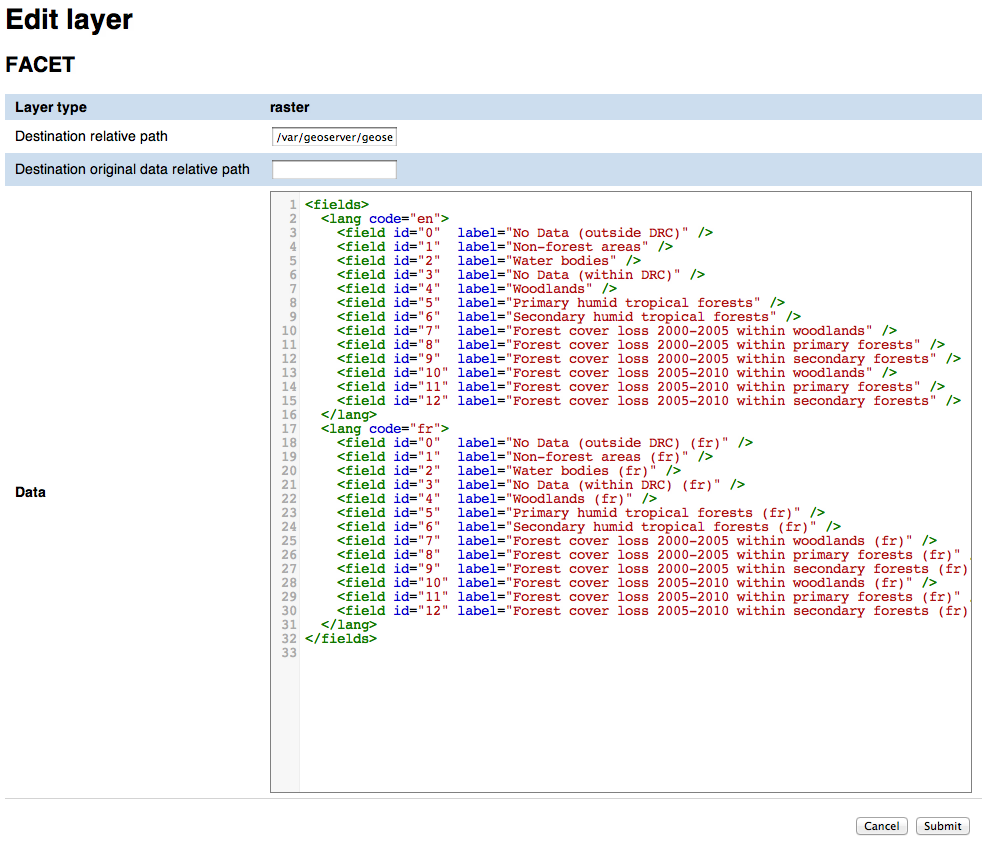
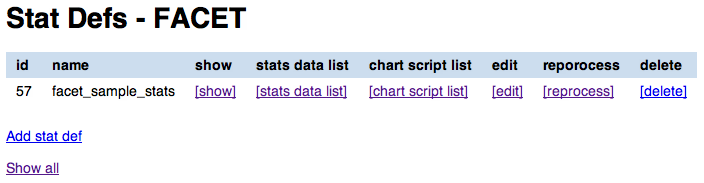
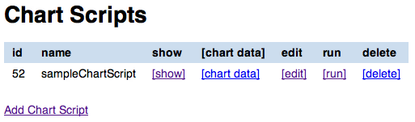
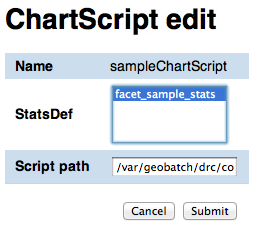
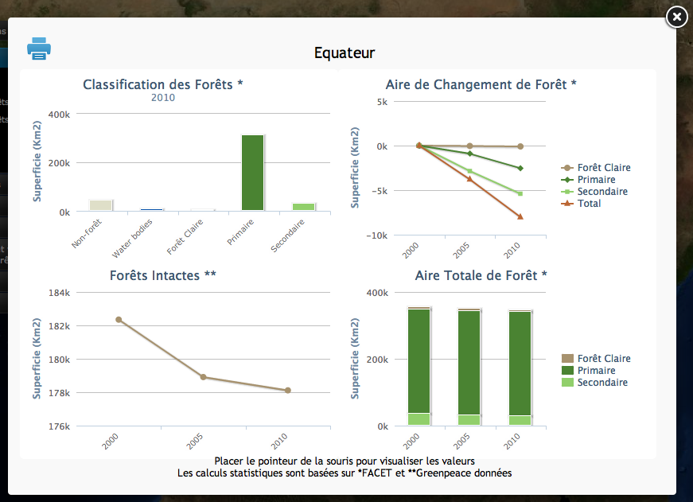

.. GeoStore Admin User Interface documentation master file, created by
   sphinx-quickstart on Thu Jun 14 10:58:26 2012.
   You can adapt this file completely to your liking, but it should at least
   contain the root `toctree` directive.

=============================================
UNREDD GeoStore Administration User Interface
=============================================

Contents:

.. toctree::
   :maxdepth: 2

Introduction
^^^^^^^^^^^^

The UNREDD NFMS portal relies on GeoStore and GeoBatch to process data coming from the analysis tool, publish them on GeoServer and to produce statistics and charts.

The UNREDD GeoStore Administration User Interface allows the administrator user of the UNREDD NFMS portal to easily configure and manage the publication and processing flows by creating and editing the following GeoStore resource types:

* Layers
* Stats defs
* Chart scripts

In addition it allows to show the data that are automatically ingested by the ingestion flow as new data (time instance for a given layer) arrives, and data produced by the processing flow:

* Layer updates (ingestion flow)
* Stats data (processing flow)
* Chart data (processing flow)

Finally, it allows the administrator to launch the processing flow when spatial data, or the statistics definition xml, or a Groovy script are modified.

In the following chapters we'll see in detail how the administrator user can manage the web portal.

Layers
^^^^^^

.. _layer-list:

Layer list
==========

In the Layers page you can view and manage the list of all the layers managed by GeoStore/GeoBatch. For each of the layers the following operation are available:

* :ref:`sho Layer attributes <show-layer-attributes>` (``[show]`` links in the image below)
* :ref:`edit the Layer attributes <edit-layer-attributes>` (``[edit]`` links in the image below)
* :ref:`delete the layer <delete-a-layer>` (``[delete]`` links in the image below)
* :ref:`view layer updates related to the layer <view-layer-updates>`  (``[layer updates]`` links in the image below)

You can also add a new raster or vector layer record using the ``[vector]`` and ``[raster]`` buttons.

.. figure:: _static/layer_list.png
   :width: 400
   :align: center

   Layer List

.. TODO: add the reprocess link

.. _show-layer-attributes:

Show layer attributes
=====================

To show the attributes of a layer record click on the ``[show]`` link next to its name. As the raster and vector layers have different sets of attributes, the visualization page differs depending on the one you choose (see the :ref:`show-raster-attributes-image` and :ref:`show-vector-attributes-image` images below).

From the Layer show page you can

* :ref:`access to the list of Layer Updates <layer-update-list>` (``[Layer Updates]`` link)
* :ref:`view the list of Stats Defs related to this layer <stats-def-list>` (``[Stats Defs]`` link)
* :ref:`access the show pages for the single Stats Defs <stats-def-show>`

.. _raster-layer-show:

Show raster layers attributes
-----------------------------

.. _show-raster-attributes-image:

.. figure:: _static/raster_layer_show.png
   :width: 400
   :align: center

   Show raster layer

In this page you can view all the attributes for a given raster layer. For attribute definition please refer to :ref:`raster-layer-edit-form`.

.. _vector-layer-show:

Show vector layers attributes
-----------------------------

.. _show-vector-attributes-image:

.. figure:: _static/vector_layer_show.png
   :width: 400
   :align: center

   Show vector layer

In this page you can view attributes and data for a given vector layer. For attribute definition please refer to :ref:`vector-layer-edit-form`.

.. _edit-layer-attributes:

Edit layer attributes
=====================

.. _raster-layer-edit-form:

Raster layer add/edit form
--------------------------

   Raster layer edit form

In the raster layer edit form you can enter the following attributes for a raster layer:

type
	This is actually not editable as it's automatically filled when you click on the add ``[raster]`` or ``[vector]`` layer links in the :ref:`layer-list` page
Dissemination mosaic path
	Full path of directory where the geotiff has to be copied in the Dissemination System, in the Publish flow. *This field may be not used in sites where the dissemination system and the stagin area share the same filesystem*
Data destination path
	Full path where the original data has to be moved in
URL
	URL to download the data
Data
	Language data related to a the layer attribute. This data will be used by the scripts that create the statistics page from the stats data (see :ref:`chart-script-list`). There's no specification at the moment for the data format as it's up to the Groovy script to parse it in order to create the localized charts

.. Add Raster width and Raster height to the list above?

Once done with the editing you can click on the ``Submit`` button to save the changes, or you can click ``Cancel`` at any moment to cancel the editing.

.. _vector-layer-edit-form:

Vector layer add/edit form
--------------------------

.. figure:: _static/vector_layer_edit.png
   :width: 600
   :align: center

   Vector layer edit form

In addition to the raster layer fields, vector layers have the following ones:

Raster width
	Needed for rasterization
Raster height
	Needed for rasterization
Min x
	Minimum x coordinate in EPSG:4326 coordinate reference system
Max x
	Maximum x coordinate in EPSG:4326 coordinate reference system
Min y
	Minimum y coordinate in EPSG:4326 coordinate reference system
Max y
	Maximum y coordinate in EPSG:4326 coordinate reference system
Attribute name
	Name of the numeric feature attribute to set in the raster
CQL filter
	(optional) CQL filter used to filter the features to be reported on the raster
No-data value
	No-data value for the raster
Data type
	Data type for output raster It's one of the GDAL-recognized data types (Byte, Int16, UInt16, Int32, UInt32, Float32, Float64, CInt16, CInt32, CFloat32, CFloat64)

.. _view-layer-updates:

View layer updates related to a layer record
============================================

To access the layer updates page for a given layer (see :ref:`layer-update-list`) you can either click on the ``[layer updates]`` link in the :ref:`layer-list` , or on the ``Layer updates`` link in the layer show page (see :ref:`raster-layer-show` and :ref:`vector-layer-show`).

.. _delete-a-layer:

Delete a layer
==============

To delete a layer click on the ``[delete]`` link in the layer list and click Ok on the confirmation dialog. All the layer updates for the layer are automatically deleted.

Layer updates
^^^^^^^^^^^^^

Layer updates represent time instance for a given layer

.. _layer-update-list:

Layer update list
=================

.. figure:: _static/layer_update_list.png
   :width: 500
   :align: center

   Layer update list

The layer updates page shows all the layer updates available for a given layer. For each layer update you can:

* :ref:`publish the layer update <layer-update-publish>`
* :ref:`republish the layer update <layer-update-republish>` if the layer has been modified. The new version of the file, together with the statistics produced by the reprocess flow, are then moved to the dissemination system
* :ref:`start the reprocess flow <layer-update-reprocess>` to recalculate statistics and produce the charts for the layer update.

.. _layer-update-publish:

Publish a layer update
======================

To publish a layer update, click on the ``[publish]`` button in the layer update list. When you publish a layer update the following operations are performed by GeoBatch:

* the layer update (time instance for the layer) is published on the dissemination GeoServer
* the related chart data are moved from the staging GeoStore server to the dissemination one

.. _layer-update-reprocess:

Reprocess a layer update
========================

When the administrator changes some of the layer updates by editing them in the administration interface (for example after some user's feedback in the dissemination tool) you can manually start the GeoBatch reprocess flow and start the processing chain. More in detail the following operations are performed by GeoBatch when clicking on the ``[reprocess]`` button:

1. if it's a layer update related to a vector layer, it gets rasterized
2. all the stats data linked to the layer which the layer update belongs to are recalculated
3. all the chart data (charts and tables) are re-rendered using the recalculated stats data

.. _layer-update-republish:

Republish a layer update
========================

If the layer update has already been published and you modified either the layer update raster/vector file or the charts by running the reprocessing flow (see :ref:`layer-update-reprocess`), you can republish it and the operations described in :ref:`layer-update-publish` are performed with the new data.

Stats defs
^^^^^^^^^^

Stats defs records define the statistics to be calculated from a set of layers. As data, they contain the XML definition that is used by the statistics calculation process to produce the CSV data that will be stored in stats data records

.. _stats-def-list:

Stats def list
==============

   Stats def list

The stats defs list page shows the Stats defs linked to a given layer, or alternatively all the stats defs available in GeoStore. In the stats defs list page you can:

* :ref:`show all the attributes for a given stats def <stats-def-show>` (``[show]`` link)
* :ref:`view all the stats data produced by a given stats def <stats-data-list>` (``[stats data list]`` link)
* :ref:`view the list of chart scripts depending on a given stats def <chart-script-list>` (``[chart script list]`` link)
* :ref:`edit the stats def <stats-def-edit>` (``[edit]`` link)
* :ref:`run the reprocess flow <stats-def-reprocess>` (``[reprocess]`` link)
* :ref:`delete the stats def flow <stats-def-delete>` (``[delete]`` link)
* :ref:`view all the stats defs available in GeoStores <view-stats-data>` (``Show all`` link)

You can also add a new stats def by clicking on the ``Add stats def`` list, that opens the :ref:`stats def edit form <stats-def-edit>`

.. _stats-def-show:

Show stats def attributes
=========================

.. figure:: _static/stats_def_show.png
   :width: 600
   :align: center

   Stats def show

In this page you can view attributes and data for a given stats def record. For attribute definition please refer to :ref:`stats-def-edit`.

The page also contains links to the layers the stats def refers to and to chart scripts that depend on it.

.. _stats-def-edit:

Stats def edit/add form
=======================

.. figure:: _static/stats_def_edit.png
   :width: 600
   :align: center

   Stats def edit form

In the stats def edit/add form you can enter the following attributes:

Name
	The name of the stats def (only editable if adding a new stats def, not when editing an existing one)
Layers
	The layers this stats def depends on
Zonal layer
	The zonal layer, as defined in the XML stats definition
XML
	The XML configuration for the statistics calculation process

Once done with the editing you can click on the ``Submit`` button to save the changes, or you can click ``Cancel`` at any moment to cancel the editing.

.. _stats-def-reprocess:

Reprocess a stats def
=====================

When a stats def record is edited it's necessary to run the reprocess flow to calculate the statistics and produce the new charts with the new definition for the statistics. The reprocess flow is run manually by clicking the ``[reprocess]`` link. The folling operations are performed

* the stats calculation procedure is run to recalculate the stats data
* all the chart data (charts and tables) are re-rendered using the recalculated stats data

.. _stats-def-delete:

Delete a stats def
==================

To delete a stats def click on its ``[delete]`` link in the stats def list and click Ok to the confirmation dialog. All the related stats data are automatically deleted.

.. _view-stats-data:

View related stats data
=======================

To access the stats data list for a given stats def (see :ref:`stats-data-list`) you can click on the ``[stats data list]`` link in the :ref:`stats def list <stats-def-list>`.

.. _stats-data-list:

Stats data list
===============

.. figure:: _static/stats_data_list.png
   :width: 500
   :align: center

   Stats data list

The stats data page shows all the stats data available for a given stats def. For each stats data you can:

* view its record attributes:

  * name
  * related stats def
  * year
  * month (optional)

* go back to the related :ref:`stats def show page <stats-def-show>`
* view the actual data (``[show data]`` link)

Chart scripts
^^^^^^^^^^^^^

Chart scripts records basically contain the absolute path to a Groovy script that will produce charts and tables from the CSV produced by the stats defs and stored in stats data records. It also contains references to the stats defs it depends to.

.. _chart-script-list:

Chart script list
=================

   Chart script list

The chart script list page shows all the chart scripts linked to a given stats def. For each chart script you can:

* :ref:`view the chart script attributes <chart-script-show>`
* :ref:`edit the chart script attributes <chart-script-edit>`
* :ref:`run a chart script <chart-script-run>`
* :ref:`delete a chart script <chart-script-delete>`
* :ref:`view the list of related chart data <chart-data-list>`

You can create a new chart script record by clicking on the ``Add chart script`` link.

.. _chart-script-show:

Show chart script attributes
============================

.. figure:: _static/chart_script_show.png
   :width: 400
   :align: center

   Show chart script

In this page you can view attributes and data for a given chart script record. For attribute definition please refer to :ref:`chart-script-edit`.

The page also contains the link to the stats def record a chart script depends on.

.. _chart-script-edit:

Chart script edit/add form
==========================

   Chart script edit

In the chart script edit/add form you can enter the following attribute for a stats def:

Name
	The name of the chart script (only editable if adding a new chart script, not when editing an existing one)
StatsDef
	The list of stats defs this chart script depends on
Script path
	Absolute path of the Groovy script that creates the chart data

Once done with the editing you can click on the ``Submit`` button to save the changes, or you can click ``Cancel`` at any moment to cancel the editing.

.. _chart-script-run:

Run a chart script
==================

If the chart script has been modified you can rebuild the charts and by clicking the ``[run]`` link.

.. TODO: check if the layer needs to be published

.. _chart-script-delete:

Delete a chart script
=====================

To delete a chart script click on the ``[delete]`` link in the chart script list and click Ok on the confirmation dialog. All the related chart data are automatically deleted.

.. _chart-data:

Chart data
^^^^^^^^^^

Chart data records contain the charts that are generated by the Groovy chart scripts.

.. _chart-data-list:

Chart data list
===============

.. figure:: _static/chart_data_list.png
   :width: 400
   :align: center

   Chart data list

By clicking on the `[chart data]` link in the chart script list page you get a list of all the charts produced by the script. To preview the chart before publishing you can click on one of the chart data links (see :ref:`chart-data-image` image below).

.. _chart-data-image:

   Chart data overview

Indices and tables
^^^^^^^^^^^^^^^^^^

* :ref:`genindex`
* :ref:`modindex`
* :ref:`search`

