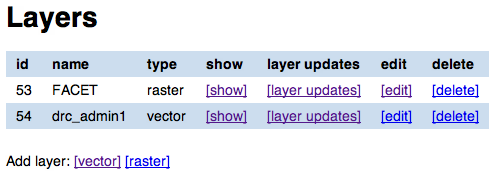
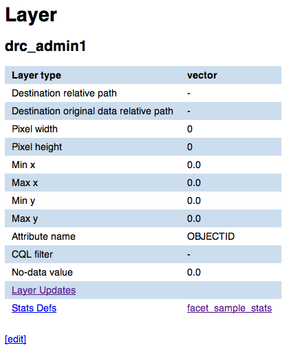
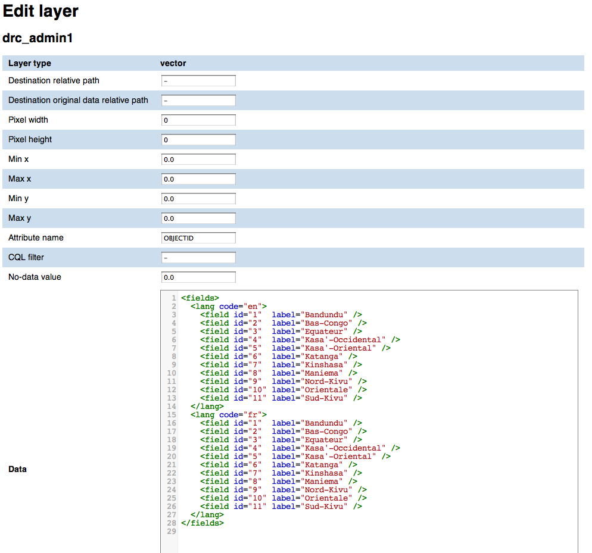
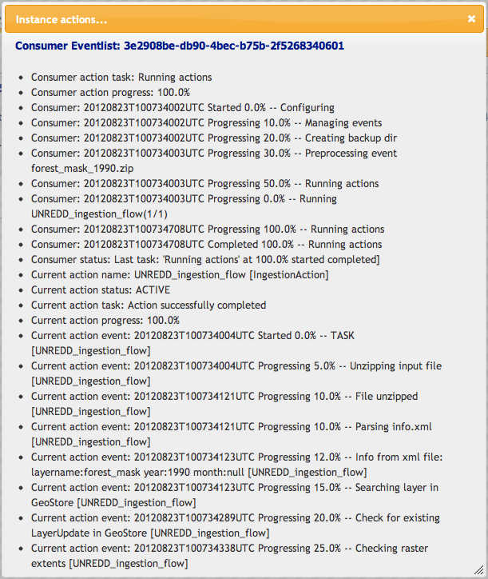
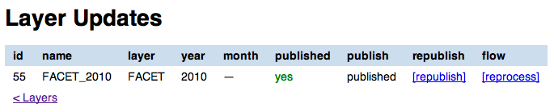
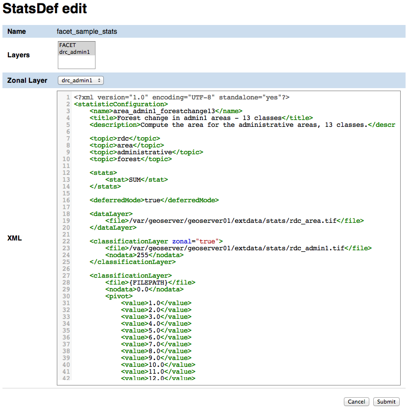
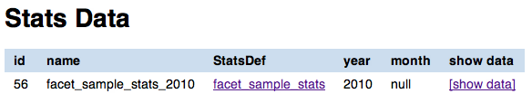

======================
Interface description
======================

The UNREDD NFMS portal relies on GeoStore and GeoBatch to process data coming from the analysis tool, publish them on GeoServer and to produce statistics and charts.

The UNREDD GeoStore Administration User Interface allows the administrator user of the UNREDD NFMS portal to easily configure and manage the publication and processing flows by creating and editing the following GeoStore resource types:

* Layers
* Stats defs
* Chart scripts

In addition it allows to show the data that are automatically ingested by the ingestion flow as new data (time instance for a given layer) arrives, and data produced by the processing flow:

* Layer updates (ingestion flow)
* Stats data (processing flow)
* Chart data (processing flow)

Finally, it allows the administrator to launch the processing flow when spatial data, or the statistics definition xml, or a Groovy script are modified.

In the following chapters we'll see in detail how the administrator user can manage the web portal.

Layers
^^^^^^

.. _layer-list:

Layer list
==========

In the Layers page you can view and manage the list of all the layers managed by GeoStore/GeoBatch. For each of the layers the following operation are available:

* :ref:`sho Layer attributes <show-layer-attributes>` (``[show]`` links in the image below)
* :ref:`edit the Layer attributes <edit-layer-attributes>` (``[edit]`` links in the image below)
* :ref:`delete the layer <delete-a-layer>` (``[delete]`` links in the image below)
* :ref:`view layer updates related to the layer <view-layer-updates>`  (``[layer updates]`` links in the image below)

You can also add a new raster or vector layer record using the ``[vector]`` and ``[raster]`` buttons.

   Layer List

.. TODO: add the reprocess link

.. _show-layer-attributes:

Show layer attributes
=====================

To show the attributes of a layer record click on the ``[show]`` link next to its name. As the raster and vector layers have different sets of attributes, the visualization page differs depending on the one you choose (see the :ref:`show-raster-attributes-image` and :ref:`show-vector-attributes-image` images below).

From the Layer show page you can

* :ref:`access to the list of Layer Updates <layer-update-list>` (``[Layer Updates]`` link)
* :ref:`view the list of Stats Defs related to this layer <stats-def-list>` (``[Stats Defs]`` link)
* :ref:`access the show pages for the single Stats Defs <stats-def-show>`

.. _raster-layer-show:

Show raster layers attributes
-----------------------------

.. _show-raster-attributes-image:

.. figure:: img/raster_layer_show.png
   :width: 400
   :align: center

   Show raster layer

In this page you can view all the attributes for a given raster layer. For attribute definition please refer to :ref:`raster-layer-edit-form`.

.. _vector-layer-show:

Show vector layers attributes
-----------------------------

.. _show-vector-attributes-image:

   Show vector layer

In this page you can view attributes and data for a given vector layer. For attribute definition please refer to :ref:`vector-layer-edit-form`.

.. _edit-layer-attributes:

Edit layer attributes
=====================

.. _raster-layer-edit-form:

Raster layer add/edit form
--------------------------

.. figure:: img/raster_layer_edit.png
   :width: 600
   :align: center

   Raster layer edit form

In the raster layer edit form you can enter the following attributes for a raster layer:

type
	This is actually not editable as it's automatically filled when you click on the add ``[raster]`` or ``[vector]`` layer links in the :ref:`layer-list` page
Dissemination mosaic path
	Full path of directory where the geotiff has to be copied in the Dissemination System, in the Publish flow. *This field may be not used in sites where the dissemination system and the stagin area share the same filesystem*
Data destination path
	Full path where the original data has to be moved in
URL
	URL to download the data
Data
	Language data related to a the layer attribute. This data will be used by the scripts that create the statistics page from the stats data (see :ref:`chart-script-list`). There's no specification at the moment for the data format as it's up to the Groovy script to parse it in order to create the localized charts

.. Add Raster width and Raster height to the list above?

Once done with the editing you can click on the ``Submit`` button to save the changes, or you can click ``Cancel`` at any moment to cancel the editing.

.. _vector-layer-edit-form:

Vector layer add/edit form
--------------------------

   Vector layer edit form

In addition to the raster layer fields, vector layers have the following ones:

Raster width
	Needed for rasterization
Raster height
	Needed for rasterization
Min x
	Minimum x coordinate in EPSG:4326 coordinate reference system
Max x
	Maximum x coordinate in EPSG:4326 coordinate reference system
Min y
	Minimum y coordinate in EPSG:4326 coordinate reference system
Max y
	Maximum y coordinate in EPSG:4326 coordinate reference system
Attribute name
	Name of the numeric feature attribute to set in the raster
CQL filter
	(optional) CQL filter used to filter the features to be reported on the raster
No-data value
	No-data value for the raster
Data type
	Data type for output raster It's one of the GDAL-recognized data types (Byte, Int16, UInt16, Int32, UInt32, Float32, Float64, CInt16, CInt32, CFloat32, CFloat64)

.. _view-layer-updates:

View layer updates related to a layer record
============================================

To access the layer updates page for a given layer (see :ref:`layer-update-list`) you can either click on the ``[layer updates]`` link in the :ref:`layer-list` , or on the ``Layer updates`` link in the layer show page (see :ref:`raster-layer-show` and :ref:`vector-layer-show`).

.. _delete-a-layer:

Delete a layer
==============

To delete a layer click on the ``[delete]`` link in the layer list and click Ok on the confirmation dialog. All the layer updates for the layer are automatically deleted.

Layer updates
^^^^^^^^^^^^^

Layer updates represent time instance for a given layer

.. _layer-update-list:

Ingest a new time instance for the layer
========================================

We are now going to see how to ingest a new ``LayerUpdate``.
We will manually simulate the behavior of the analysis software
by copying the zip files containing the spatial data and XML definition
into the GeoBatch ``ingest`` directory, thus triggering the GeoBatch ingestion flow.

But before we go on with the ingestion flow, let's have a look to how the zip
files are built internally: it must contain an XML file ``info.xml``, and a directory
``data``.

* The directory ``data`` contains the geodata to be published in the dissemination system, and to be used to compute statistics.
* The content of the file ``info.xml`` is:

  .. code-block:: xml
  
    <?xml version="1.0" encoding="UTF-8"?>
    <info>
      <layername>forest_mask</layername>  
      <format>raster</format>
      <year>2012</year>
      <month>08</month>
      <day>15</day>
    </info>

  where
  
  * ``<layername>`` is the name of the layer this update should be appended to
  * ``<format>`` may be raster or vector
  * ``<year>`` is a mandatory element in a 4 digit format representing the year this update should be referenced to
  * ``<month>`` is a optional element in a 2 digit representing the month this update should be referenced to (ranging from 01 to 12)
  * ``<month>`` is a optional element in a 2 digit representing the month this update should be referenced to

To start the ingestion, generate a zip file with the described contents, and copy it into ``/var/geobatch/input/ingestion/``.

You can view the status of the ingestion flow on the GeoBatch admin interface:

* Browse to geobatch main page.
* Click on *Manage flows*
* Insert user name and password and click *Submit*
* Click on *IngestionFlow*
* Click on *Instances*

You should see one instance running or completed:

.. figure:: img/ingestion_flow_1.png
   :align: center
   :scale: 80 %

You can also view the log for the ingestion you just did by clicking on the *instance logs* icon.

You can also check that the store and layer have been created on GeoServer by GeoBatch:

* Browse to the geoserver main page.
* Insert user name and password and click *Submit*
* Click on *Stores*
* Check that the new store is there (same name as Layer in GeoBatch)
  
  .. figure:: img/geoserver_check_ingestion_1.png
     :align: center
     :scale: 80 %

* Click on *Layers*
* Check that the layer is there

  .. figure:: img/geoserver_check_ingestion_2.png
     :align: center
     :scale: 80 %

For the first layer update, the default style and the time dependency for the layer has to be set
in GeoServer.

* Click on *Layers*
* Click on layer name
* Click on the *Publishing* tab
* Under the *Default style* menu choose the desired style.

  .. figure:: img/forest_mask_style.png
     :align: center

* Click on the *Dimension* tab
* Check the *Enabled* checkbox
* Under the *Presentation* menu choose *List*

  .. figure:: img/forest_mask_dimensions.png
     :align: center

Layer update list
=================

   Layer update list

The layer updates page shows all the layer updates available for a given layer. For each layer update you can:

* :ref:`publish the layer update <layer-update-publish>`
* :ref:`republish the layer update <layer-update-republish>` if the layer has been modified. The new version of the file, together with the statistics produced by the reprocess flow, are then moved to the dissemination system
* :ref:`start the reprocess flow <layer-update-reprocess>` to recalculate statistics and produce the charts for the layer update.

.. _layer-update-publish:

Publish a layer update
======================

To publish a layer update, click on the ``[publish]`` button in the layer update list. When you publish a layer update the following operations are performed by GeoBatch:

* the layer update (time instance for the layer) is published on the dissemination GeoServer
* the related chart data are moved from the staging GeoStore server to the dissemination one

.. _layer-update-reprocess:

Reprocess a layer update
========================

When the administrator changes some of the layer updates by editing them in the administration interface (for example after some user's feedback in the dissemination tool) you can manually start the GeoBatch reprocess flow and start the processing chain. More in detail the following operations are performed by GeoBatch when clicking on the ``[reprocess]`` button:

1. if it's a layer update related to a vector layer, it gets rasterized
2. all the stats data linked to the layer which the layer update belongs to are recalculated
3. all the chart data (charts and tables) are re-rendered using the recalculated stats data

.. _layer-update-republish:

Republish a layer update
========================

If the layer update has already been published and you modified either the layer update raster/vector file or the charts by running the reprocessing flow (see :ref:`layer-update-reprocess`), you can republish it and the operations described in :ref:`layer-update-publish` are performed with the new data.

Stats defs
^^^^^^^^^^

Stats defs records define the statistics to be calculated from a set of layers. As data, they contain the XML definition that is used by the statistics calculation process to produce the CSV data that will be stored in stats data records

.. _stats-def-list:

Stats def list
==============

.. figure:: img/stats_def_list.png
   :width: 500
   :align: center

   Stats def list

The stats defs list page shows the Stats defs linked to a given layer, or alternatively all the stats defs available in GeoStore. In the stats defs list page you can:

* :ref:`show all the attributes for a given stats def <stats-def-show>` (``[show]`` link)
* :ref:`view all the stats data produced by a given stats def <stats-data-list>` (``[stats data list]`` link)
* :ref:`view the list of chart scripts depending on a given stats def <chart-script-list>` (``[chart script list]`` link)
* :ref:`edit the stats def <stats-def-edit>` (``[edit]`` link)
* :ref:`run the reprocess flow <stats-def-reprocess>` (``[reprocess]`` link)
* :ref:`delete the stats def flow <stats-def-delete>` (``[delete]`` link)
* :ref:`view all the stats defs available in GeoStores <view-stats-data>` (``Show all`` link)

You can also add a new stats def by clicking on the ``Add stats def`` list, that opens the :ref:`stats def edit form <stats-def-edit>`

.. _stats-def-show:

Show stats def attributes
=========================

.. figure:: img/stats_def_show.png
   :width: 600
   :align: center

   Stats def show

In this page you can view attributes and data for a given stats def record. For attribute definition please refer to :ref:`stats-def-edit`.

The page also contains links to the layers the stats def refers to and to chart scripts that depend on it.

.. _stats-def-edit:

Stats def edit/add form
=======================

   Stats def edit form

In the stats def edit/add form you can enter the following attributes:

Name
	The name of the stats def (only editable if adding a new stats def, not when editing an existing one)
Layers
	The layers this stats def depends on
Zonal layer
	The zonal layer, as defined in the XML stats definition
XML
	The XML configuration for the statistics calculation process

Once done with the editing you can click on the ``Submit`` button to save the changes, or you can click ``Cancel`` at any moment to cancel the editing.

.. _stats-def-reprocess:

Reprocess a stats def
=====================

When a stats def record is edited it's necessary to run the reprocess flow to calculate the statistics and produce the new charts with the new definition for the statistics. The reprocess flow is run manually by clicking the ``[reprocess]`` link. The folling operations are performed

* the stats calculation procedure is run to recalculate the stats data
* all the chart data (charts and tables) are re-rendered using the recalculated stats data

.. _stats-def-delete:

Delete a stats def
==================

To delete a stats def click on its ``[delete]`` link in the stats def list and click Ok to the confirmation dialog. All the related stats data are automatically deleted.

.. _view-stats-data:

View related stats data
=======================

To access the stats data list for a given stats def (see :ref:`stats-data-list`) you can click on the ``[stats data list]`` link in the :ref:`stats def list <stats-def-list>`.

.. _stats-data-list:

Stats data list
===============

   Stats data list

The stats data page shows all the stats data available for a given stats def. For each stats data you can:

* view its record attributes:

  * name
  * related stats def
  * year
  * month (optional)

* go back to the related :ref:`stats def show page <stats-def-show>`
* view the actual data (``[show data]`` link)

Chart scripts
^^^^^^^^^^^^^

Chart scripts records basically contain the absolute path to a Groovy script that will produce charts and tables from the CSV produced by the stats defs and stored in stats data records. It also contains references to the stats defs it depends to.

External files needed for chartscript execution
===============================================

The chart script execution needs three files:

* ``deforestation_stats.groovy``, the main groovy script to build the chart. An example:

.. code-block:: groovy

    import groovy.text.SimpleTemplateEngine
    import java.util.Map
    import org.slf4j.Logger;
    import org.slf4j.LoggerFactory;
    import org.apache.commons.io.IOUtils
    import it.geosolutions.unredd.geostore.model.UNREDDStatsData
    import it.geosolutions.unredd.geostore.model.UNREDDChartData
    import it.geosolutions.unredd.geostore.UNREDDGeostoreManager
    import it.geosolutions.geostore.services.rest.model.RESTResource
    import it.geosolutions.geostore.services.rest.GeoStoreClient
    import it.geosolutions.geostore.services.rest.model.RESTStoredData
    import it.geosolutions.geostore.core.model.Resource
    import it.geosolutions.geostore.core.model.Attribute

    log = LoggerFactory.getLogger("deforestation_stats.groovy");

    println "_TEST_"
    log.info "_TEST_"

    htmlTemplateFilePath = '/home/unredd/Desktop/pry_workshop_data/groovy_script/deforestation_chart_template.html' // DEBUG
    langFilePath         = '/home/unredd/Desktop/pry_workshop_data/groovy_script/lang.csv'

    csvSeparator = ';'

    // The following lines are used to test the script
    // Comment out them for deploying with GeoBatch
    class Conf {
        def geostore_url
        def geostore_username
        def geostore_password
        def chartscript_name
    }
    def argsMap = [
        configuration: new Conf(
            geostore_url:      "http://127.0.0.1:9191/geostore/rest",
            geostore_username: "admin",
            geostore_password: "admin",
            chartscript_name:  "deforestation_script"
        )
    ];
    //execute(argsMap)
    // Comment out up to here

    def execute(Map argsMap)
    {
        log.info "Starting chart script"

        GeoStoreClient client = createGeoStore(argsMap);
        UNREDDGeostoreManager manager = new UNREDDGeostoreManager(client)
        
        chartScriptName = argsMap.get("configuration").getProperties().get("chartscript_name");
        
        // Load forest change forest data
        forestData = importData(manager, 'forest_mask_stats', true)
        nonForestData = importData(manager, 'forest_mask_stats', false)
        
        // Load localized data
        loc = loadLangData(langFilePath)
        
        def engine = new SimpleTemplateEngine()
        def htmlTemplate = engine.createTemplate(new File(htmlTemplateFilePath));
        //def csvTemplate  = engine.createTemplate(new File(csvTemplateFilePath));
            
        def lastYear  = null;
        def firstYear = null;
        
        deletePreviousChartData(client, chartScriptName);
        
        // Iterate through the languages
        loc.each { langKey, loc ->
            // Create one HTML per row in the forest change stats data
            forestData.each() { featureId, row ->
                try {
                    def years = row.keySet();
                    if (lastYear  == null) lastYear  = years.max()
                    if (firstYear == null) firstYear = years.min()

                    def binding = ['loc': loc, 'forest': row, 'nonForest': nonForestData[featureId], 'lastYear': lastYear, 'firstYear': firstYear]
                    html = htmlTemplate.make(binding)

                    // DEBUG: Save as file
                    //polygonId = deforestationValues[0] as int;
                    //outputFilePath = outputBaseDir + '/' + langKey + '/' + prefix + '/' + prefix + '_' + featureId + '.html'
                    //saveAsFile(html, outputFilePath)
                    //saveAsFile(html, '/Users/sgiaccio/stats/' + featureId + '.html') // DEBUG
                    
                    // Save in GeoStore
                    def resourceName = chartScriptName + "_" + featureId + "_" + langKey
                    id = saveOnGeoStore(client, featureId, resourceName, html.toString(), "deforestation_script", false, langKey, "html")
                    log.info "GeoStore resource saved: Resource Name = " + resourceName + " - ID = " + id
                } catch (Exception e) {
                    log.info("Problem encountered in creating chart for featureId = " + featureId)
                    e.printStackTrace();
                }
            }
            
            // Create csv
            //def csvBinding = ['loc': loc, 'forestChange': forestChangeStatsData]
            //def csv = csvTemplate.make(csvBinding)
            //println csv; // DEBUG
        }
        
        return ["return": []]
    }

    def loadLangData(langFilePath)
    {
        langFile = new File(langFilePath)
        lines = langFile.readLines()
        headerLine = lines.head().split("\t")
        languages = headerLine.tail() // remove first column from first line (it's not a language code nor a label id)
        
        // fill the loc hash map
        loc = [:]
        lines = lines.tail()
        lines.each { row ->
            splitRow = row.split("\t")
            key = splitRow.head()
            splitRow = splitRow.tail()
            splitRow.eachWithIndex { column, i ->
                values = loc[languages[i]]
                if (values == null) {
                    loc[languages[i]] = [:]
                    loc[languages[i]][key] = column
                } else {
                    values[key] = column //.strip()
                }
            }
        }
        
        return loc
    }

    def deletePreviousChartData(client, chartScriptName) {
        UNREDDGeostoreManager manager = new UNREDDGeostoreManager(client)

        // Search all chart data for the given chart script
        List data = manager.searchChartDataByChartScript(chartScriptName)

        // Delete the chart data found
        for (chartData in data)
        {
            def id = chartData.getId();
            log.info("Resource deleted - id = " + id)
            
            client.deleteResource(id);
        }
    }

    def saveOnGeoStore(client, featureId, name, html, chartScriptName, published, language, format)
    {
        // Create the UNREDDChartData object and fill the atributes
        unreddChartData = new UNREDDChartData()
        unreddChartData.setAttribute(UNREDDChartData.Attributes.CHARTSCRIPT, chartScriptName)
        unreddChartData.setAttribute(UNREDDChartData.Attributes.PUBLISHED, published ? "true" : "false")
        unreddChartData.setAttribute(UNREDDChartData.Attributes.FEATUREID, featureId + "")

        // These attributes are not used yet
        //unreddChartData.setAttribute(UNREDDChartData.Attributes.LANGUAGE, language)
        //unreddChartData.setAttribute(UNREDDChartData.Attributes.FORMAT, format)

        // Create the RESTResource and set the name
        RESTResource chartDataRestResource = unreddChartData.createRESTResource()
        chartDataRestResource.setName(name)

        // Set the data to be stored
        RESTStoredData rsd = new RESTStoredData()
        rsd.setData(html)
        chartDataRestResource.setStore(rsd)
        
        // Insert in GeoStore
        int id = client.insert(chartDataRestResource)
        return id
    }

    // Loads the stats data from GeoStore
    def importData(manager, dataId, forest)
    {
        List resources = manager.searchStatsDataByStatsDef2(dataId); // dataId)
        
        Map output = new HashMap()
        
        for (Resource resource : resources)
        {
            data = resource.getData()
            
            int year  = (Float.parseFloat(getAttribute(resource.getAttribute(), UNREDDStatsData.Attributes.YEAR).getValue())).trunc()
            def lines = parseTable(data.getData(), forest)
            lines.each { id, line ->
                temp = output[id]
                if (temp == null) {
                    output[id] = new TreeMap()
                    output[id][year] = line
                } else {
                    temp[year] = line
                }
            }
        }
        
        return output
    }

    def fillNullRows(map) {
        print " ----- " + map.get(map.keySet().min());
        return null;
    }

    // Parses a CSV table - returns a HashMap where the key is the polygon ID (first column in the CSV)
    // and the value is the full parsed row (stored as an array)
    def parseTable(table, forest)
    {
        HashMap lines = new HashMap()
        
        table.eachLine { line ->
            parsedArr = []
            arr = line.tokenize(csvSeparator)
            
            if ("0".equals(arr[1]) && forest || "1".equals(arr[1]) && !forest)
                return false // skip loop
            
            polygonId = Integer.parseInt(arr[0])
            
            // Values for each administrative regions are split in two rows (forest and non-forest) - join them together again
            for (i in 2..<arr.size) // first element in array is the polygon id, don't need it
            {
                //println 'i = ' + i
                //println 'Double.parseDouble(arr[i]) = ' + Double.parseDouble(arr[i])
                //println 'parsedArr[i - 2] = ' + parsedArr[i - 2]
                parsedArr[i - 2] = Double.parseDouble(arr[i])
            }
            
            //println 'parsedArr = ' + parsedArr
            lines.put(polygonId, parsedArr)
        }
        
        //print lines
        return lines
    }

    def getAttribute(List attributeList, attribute)
    {
        for (Attribute attr : attributeList) {
            if (attr.getName().equals(attribute.getName())) {
                return attr
            }
        }
        
        return null
    }

    def saveAsFile(html, outputFilePath)
    {
        log.info("Saving output to file: " + outputFilePath);
        out = new File(outputFilePath)
        out.write(html.toString(), "UTF-8")
    }

    GeoStoreClient createGeoStore(Map argsMap) {
        Map props = argsMap.get("configuration").getProperties();

        log.info("geostore url: " + props.get("geostore_url"));

        String gurl  = props.get("geostore_url");
        String guser = props.get("geostore_username");
        String gpw   = props.get("geostore_password");

        GeoStoreClient client = new GeoStoreClient();
        client.setGeostoreRestUrl(gurl);
        client.setUsername(guser);
        client.setPassword(gpw);
        return client;
    }

* ``deforestation_chart_template.html``, the html template used by the groovy script. For example:

.. code-block:: html

    <!DOCTYPE HTML PUBLIC "-//W3C//DTD HTML 4.01//EN" "http://www.w3.org/TR/html4/strict.dtd">
    <html>
      <head>
        <meta http-equiv="Content-Type" content="text/html; charset=utf-8">
        <title>Chart</title>
        
        
        

        
        
        
        
      </head>
      <body>
        

          

            <a href="#print" title="<%= loc.print_this_chart %>" class="print" onClick="window.print();return false;"></a>
          

          

        

        
        

        
        
<%= loc.hover_text %>

      </body>
    </html>

* ``lang.csv``, contains text strings translated to the different languages. Note this is a `TAB` separated value file. For example::

    key              es                                                      en
    deforestation    Deforestacion                                           Deforestation
    Primary          Primaria                                                Primary
    area             Superficie                                              Area
    print_this_chart Imprimir esta grafica                                   Print this chart
    hover_text       Situar el raton sobre las graficas para ver los valores Please place the mouse pointer over the charts to see values

In a default configuration, these files are placed in ``/var/stg_geobatch/config/chartscripts``.
See :ref:`unredd-install-stg_geobatch`.

.. _chart-script-list:

Chart script list
=================

.. figure:: img/chart_script_list.png
   :width: 400
   :align: center

   Chart script list

The chart script list page shows all the chart scripts linked to a given stats def. For each chart script you can:

* :ref:`view the chart script attributes <chart-script-show>`
* :ref:`edit the chart script attributes <chart-script-edit>`
* :ref:`run a chart script <chart-script-run>`
* :ref:`delete a chart script <chart-script-delete>`
* :ref:`view the list of related chart data <chart-data-list>`

You can create a new chart script record by clicking on the ``Add chart script`` link.

.. _chart-script-show:

Show chart script attributes
============================

.. figure:: img/chart_script_show.png
   :width: 400
   :align: center

   Show chart script

In this page you can view attributes and data for a given chart script record. For attribute definition please refer to :ref:`chart-script-edit`.

The page also contains the link to the stats def record a chart script depends on.

.. _chart-script-edit:

Chart script edit/add form
==========================

.. figure:: img/chart_script_edit.png
   :width: 250
   :align: center

   Chart script edit

In the chart script edit/add form you can enter the following attribute for a stats def:

Name
	The name of the chart script (only editable if adding a new chart script, not when editing an existing one)
StatsDef
	The list of stats defs this chart script depends on
Script path
	Absolute path of the Groovy script that creates the chart data

Once done with the editing you can click on the ``Submit`` button to save the changes, or you can click ``Cancel`` at any moment to cancel the editing.

.. _chart-script-run:

Run a chart script
==================

If the chart script has been modified you can rebuild the charts and by clicking the ``[run]`` link.

.. TODO: check if the layer needs to be published

.. _chart-script-delete:

Delete a chart script
=====================

To delete a chart script click on the ``[delete]`` link in the chart script list and click Ok on the confirmation dialog. All the related chart data are automatically deleted.

.. _chart-data:

Chart data
^^^^^^^^^^

Chart data records contain the charts that are generated by the Groovy chart scripts.

.. _chart-data-list:

Chart data list
===============

.. figure:: img/chart_data_list.png
   :width: 400
   :align: center

   Chart data list

By clicking on the `[chart data]` link in the chart script list page you get a list of all the charts produced by the script. To preview the chart before publishing you can click on one of the chart data links (see :ref:`chart-data-image` image below).

.. _chart-data-image:

.. figure:: img/chart_data.png
   :width: 600
   :align: center

   Chart data overview

