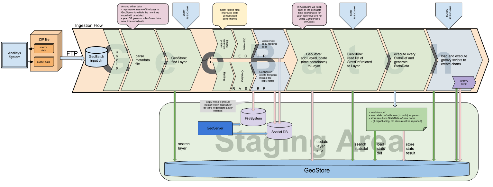

============================
Ingestion flow configuration
============================

Flow diagram
============

   
   Ingestion flow

Some insights on the ingestion flow
===================================

The Ingestion flow is quite complex, so it does not rely on GeoBatch internal Action chaining.

It has been implemented as a single Action which internally invokes other existing standard Actions (such as the Unzip action, the GeoStore action, the Scripting Action).

   
Flow configuration file
=======================

The Ingestion flow interacts with many external objects, such as PostGres, GeoStore, GeoServer.
Configuration customizations will be mainly related to how the flow will connect with such external peers.

Here's a sample flow definition for the data ingestion::

  <FlowConfiguration>
    <id>ingestionFlow</id>
    <name>UNREDD ingestion flow</name>
    <description>UNREDD - Ingest time granules for predefined raster or vector layers and process data</description>

    <!-- <overrideTempDir>/var/geobatch/drc/temp</overrideTempDir> -->
    <autorun>true</autorun>  

    <EventGeneratorConfiguration>
       <id>ingestEGC</id>
       <serviceID>fsEventGeneratorService</serviceID>

Next directory definition can be customized: it's the directory that GeoBatch monitors for new files::
       
       <watchDirectory>/var/geobatch/input/ingestion</watchDirectory>

::

       <wildCard>*.zip</wildCard>

       <osType>OS_UNDEFINED</osType>
       <eventType>FILE_ADDED</eventType>
   </EventGeneratorConfiguration>

   <EventConsumerConfiguration>
       <id>ingestionECC</id>

       <listenerId>IngestionConsumerLogger0</listenerId>
       <listenerId>IngestionCumulator0</listenerId>
       <listenerId>IngestionStatusActionLogger0</listenerId>

       <performBackup>false</performBackup>

       <!-- First and only Action configuration  --> 
       <IngestionConfiguration>
           <serviceID>IngestionGeneratorService</serviceID>

           <id>ingestionFlow</id>
           <name>UNREDD ingestion flow</name>
           <description>UNREDD - Ingest time granules for raster or vector layers and process data</description>

           <listenerId>IngestionConsumerLogger0</listenerId>
           <listenerId>IngestionCumulator0</listenerId>
           <listenerId>IngestionStatusActionLogger0</listenerId>
           
           <failIgnored>false</failIgnored>
           <!-- <overrideConfigDir>/var/geobatch/config</overrideConfigDir> -->

Next directory definition can be customized: This is the dir where original files will be put into::

       <!-- todo: review, this dir may be set in a per-layer basis -->
       <originalDataTargetDir>/var/geobatch/config/ingestion/orig</originalDataTargetDir>

This is the staging GeoStore ::           

           <geoStoreConfig>
                 <url>http://localhost:8200/geostore/rest</url>
                 <username>admin</username>
                 <password>secret!</password>
           </geoStoreConfig>

This is the PostGIS DB where vector layer features are stored::

           <postGisConfig>
               <host>localhost</host>
               <port>5432</port>
               <database>test_staging_features</database>
               <schema>public</schema>
               <username>admin</username>
               <password>secret!</password>
           </postGisConfig>

This is the staging GeoServer::

           <geoServerConfig>
               <id>gsacId</id>
               <name>gsacName</name>
               <description>gsacDesc</description>

               <failIgnored>false</failIgnored>

               <!-- Editable part: staging GeoServer -->
               <geoserverURL>http://localhost:8201/geoserver</geoserverURL>
               <geoserverUID>admin</geoserverUID>
               <geoserverPWD>secret!</geoserverPWD>

               <!-- Editable part: geoserver workspace for all layers -->
               <workspace>unredd</workspace>
           </geoServerConfig>

The final flow configuration lines can be left as they are ::

           <rasterizeConfig>
              <executable>gdal_rasterize</executable>
              <taskExecutorXslFileName>gdalrasterize.xsl</taskExecutorXslFileName>
              <freeMarkerTemplate>gdalrasterize.xml</freeMarkerTemplate>
           </rasterizeConfig>

           <overviewsEmbedderConfiguration>
               <id>id</id>
               <name>name</name>
               <description>descr</description>

               <failIgnored>false</failIgnored>

               <JAICapacity>0</JAICapacity>
               <compressionRatio>0.75</compressionRatio>
               <compressionScheme>Nearest</compressionScheme> <!-- Nearest, Bilinear, Bicubic, Average, Filtered; -->
               <downsampleStep>2</downsampleStep>
               <numSteps>42</numSteps>
               <tileH>512</tileH>
               <tileW>512</tileW>
               <wildcardString>*.*</wildcardString>
               <logNotification>true</logNotification>
               <interp>0</interp>
           </overviewsEmbedderConfiguration>

           <retilerConfiguration>
               <id>grcId</id>
               <name>grcN</name>
               <description>grcD</description>
               <failIgnored>false</failIgnored>

               <JAICapacity>0</JAICapacity>
               <compressionRatio>NaN</compressionRatio>
               <compressionScheme>LZW</compressionScheme>
               <tileH>256</tileH>
               <tileW>256</tileW>
               <forceToBigTiff>false</forceToBigTiff>
           </retilerConfiguration>

       </IngestionConfiguration>
   </EventConsumerConfiguration>
   
   <ListenerConfigurations>
       <StatusProgressListener>
           <serviceID>statusListenerService</serviceID>
           <id>IngestionStatusActionLogger0</id>
       </StatusProgressListener>

       <LoggingProgressListener>
           <serviceID>loggingListenerService</serviceID>
           <id>IngestionActionLogger0</id>
           <loggerName>IngestionActionLogger0</loggerName>
       </LoggingProgressListener>

       <LoggingProgressListener>
           <serviceID>loggingListenerService</serviceID>
           <id>IngestionConsumerLogger0</id>
           <loggerName>IngestionConsumerLogger0</loggerName>
       </LoggingProgressListener>

       <CumulatingProgressListener>
           <serviceID>cumulatingListenerService</serviceID>
           <id>IngestionCumulator0</id>
       </CumulatingProgressListener>    
   </ListenerConfigurations>

   </FlowConfiguration>

