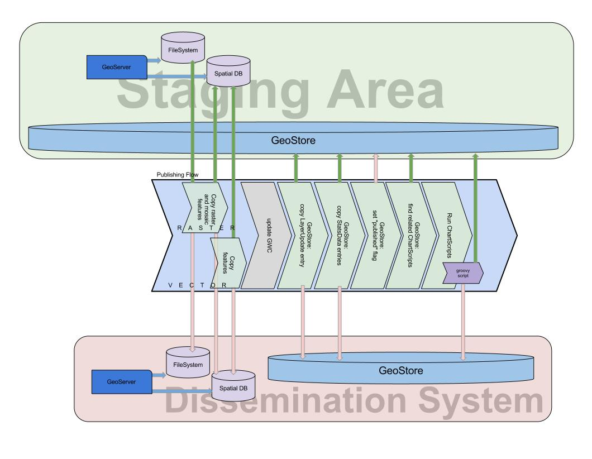

==========================
Publish flow configuration
==========================

Flow diagram
============

   
   The Publish flow diagram

   
Publish flow
==============

The publish flow is responsible for copy the resources from staging area to dissemination area, once the data are ready for pubblication.
The flow is also responsible for the re-publication of the resources, once they are changed by user feedback or by the admin.

More specifically the flow, given a layer update to publish, do the following task: 

* make a copy of the geostore status for that resource from staging geostore to dissemination geostore
* make a copy of the granule from staging geoserver to dissemination geoserver.
  In case of the resource type equals to Vector the flow copy all the feature from staging postgis to dissemination postgis. That operation may take several time.
 
In case of the first publication of a layer updateResource for a given layer the flow also add the layer resource to the dissemination geostore and create the imagemosaic store for geoserver and postgis table if the layer is Vector.

Configuration example
=====================

This is an example configuration. The environment value (URL, user, password ...) are in brackets. 
Into `nfms-geobatch release <https://github.com/nfms4redd/nfms-geobatch/blob/master/src/gb-application-unredd/src/main/webapp/WEB-INF/data/publishingFlow.xml>`_ you can find this template configuration. 
Note that xml tags use the prefix **src** to refer to *staging* and **dst** to *dissemination*::

	<?xml version="1.0" encoding="UTF-8"?>
	<FlowConfiguration>
		<id>publishingFlow</id>
		<name>UNREDD_publish_flow</name>
		<description>UNREDD - Publish layers, stats and charts into the dissemination system.</description>

		<autorun>true</autorun>

		<EventGeneratorConfiguration>
			<id>publishingEGC</id>
			<serviceID>fsEventGeneratorService</serviceID>
			<watchDirectory>{WATCH_DIRECTORY}</watchDirectory>
			<wildCard>*.xml</wildCard>
			<osType>OS_UNDEFINED</osType>
			<eventType>FILE_ADDED</eventType>
		</EventGeneratorConfiguration>

		<EventConsumerConfiguration>
			<id>publishingECC</id>
			<listenerId>PublishingConsumerLogger0</listenerId>
			<listenerId>PublishingCumulator0</listenerId>
			<listenerId>PublishingStatusActionLogger0</listenerId>
			<performBackup>false</performBackup>

			<!-- First and only Action configuration -->
			<PublishingConfiguration>
				<serviceID>PublishingGeneratorService</serviceID>

				<id>PublishingActionConfiguration</id>
				<name>Publishing_Action</name>
				<description>Single-step action for publish layers, stats, charts</description>
				<listenerId>PublishingConsumerLogger0</listenerId>
				<listenerId>PublishingCumulator0</listenerId>
				<listenerId>PublishStatusActionLogger0</listenerId>

				<failIgnored>false</failIgnored>
			
staging area GeoStore::

			<srcGeoStoreConfig>
				<url>http://localhost:{PORT}/{STAGING_GEOSTORE_CONTEXT_NAME}/rest</url>
				<username>{USERNAME}</username>
				<password>{PASSWORD}</password>
			</srcGeoStoreConfig>

staging area PostGIS::
			
			<srcPostGisConfig>
				<host>localhost</host>
				<port>5432</port>
				<!-- The user must have at least insert ad select grants -->
				<database>{DB_NAME}</database>
				<schema>{DB_SCHEMA}</schema>
				<!-- The user must have at least select grants -->
				<username>{USERNAME}</username>
				<password>{PASSWORD}</password>
			</srcPostGisConfig>
			
staging area GeoServer::
			
			<srcGeoServerConfig>
				<id>srcGSC</id>
				<name>srcGSC</name>
				<description>srcGSC</description>
				
				<failIgnored>false</failIgnored>
				<!-- Credentials and path for the staging Geoserver -->
				<geoserverURL>http://localhost:{PORT}/{STAGING_GEOSERVER_CONTEXT_NAME}</geoserverURL>
				<geoserverUID>{USERNAME}</geoserverUID>
				<geoserverPWD>{PASSWORD}</geoserverPWD>
				<workspace>{WORKSPACE_NAME}</workspace>
			</srcGeoServerConfig>

dissemination system GeoStore::			
			
			<dstGeoStoreConfig>
				<url>http://localhost:{PORT}/{DISSEMINATION_GEOSTORE_CONTEXT_NAME}/rest</url>
				<username>{USERNAME}</username>
				<password>{PASSWORD}</password>
			</dstGeoStoreConfig>

dissemination system PostGIS::			
			
			<dstPostGisConfig>
				<host>localhost</host>
				<port>5432</port>
				<!-- The user must have at least insert ad select grants -->
				<database>{DB_NAME}</database>
				<schema>{DB_SCHEMA}</schema>
				<!-- The user must have at least insert, select and create grants -->
				<username>{USERNAME}</username>
				<password>{PASSWORD}</password>
			</dstPostGisConfig>

dissemination system GeoServer::
			
			<dstGeoServerConfig>
				<id>dissGSC</id>
				<name>dissGSC</name>
				<description>dissGSC</description>
				
				<failIgnored>false</failIgnored>
				<!-- Credentials and path for the staging Geoserver -->
				<geoserverURL>http://localhost:{PORT}/{STAGING_GEOSERVER_CONTEXT_NAME}</geoserverURL>
				<geoserverUID>{USERNAME}</geoserverUID>
				<geoserverPWD>{PASSWORD}</geoserverPWD>
				<workspace>{WORKSPACE_NAME}</workspace>
			</dstGeoServerConfig>

Rest of configuration::
			
			</PublishingConfiguration>
		</EventConsumerConfiguration>

		<ListenerConfigurations>
			<StatusProgressListener>
				<serviceID>statusListenerService</serviceID>
				<id>PublishingStatusActionLogger0</id>
			</StatusProgressListener>

			<LoggingProgressListener>
				<serviceID>loggingListenerService</serviceID>
				<id>PublishingActionLogger0</id>

				<loggerName>PublishingActionLogger0</loggerName>
			</LoggingProgressListener>

			<LoggingProgressListener>
				<serviceID>loggingListenerService</serviceID>
				<id>PublishingConsumerLogger0</id>

				<loggerName>PublishingConsumerLogger0</loggerName>
			</LoggingProgressListener>

			<CumulatingProgressListener>
				<serviceID>cumulatingListenerService</serviceID>
				<id>PublishCumulator0</id>
			</CumulatingProgressListener>
		</ListenerConfigurations>
	</FlowConfiguration>

