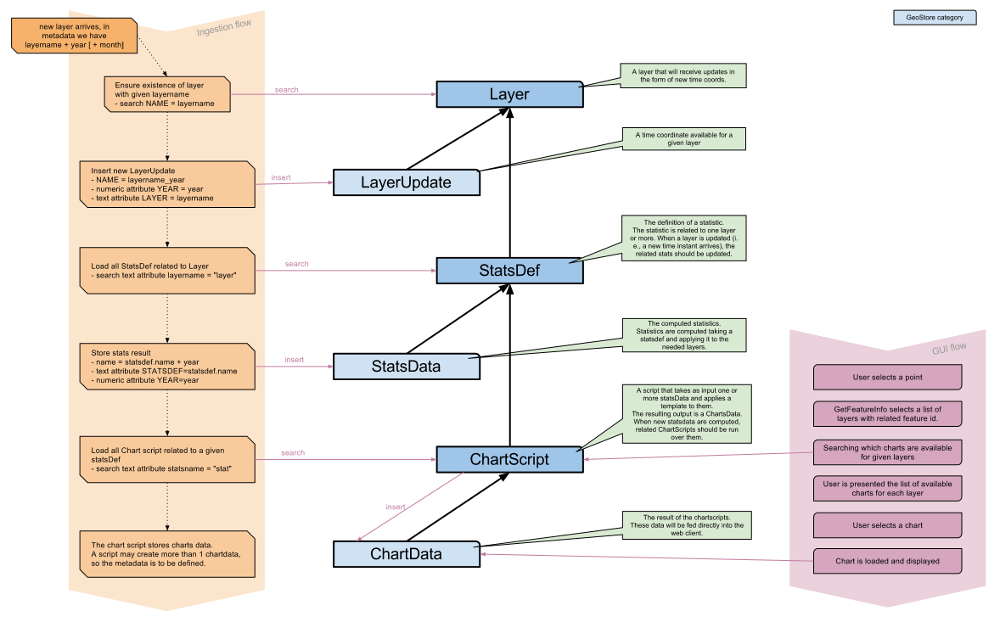

.. _unredd-geostore:

========
GeoStore
========

GeoStore is a pure backend webapp, used as a storage for any type of information.

The interesting points about GeoStore are its capability of searching data by associated metadata, 
and the ability to interact with the stored resources using simple HTTP REST calls. 
It means that backend applications can store data in GeoStore, that can then be easily retrieved by a web client.
In our specific case, a good example are the charts created on the layers statistics.

Data Model
----------

Data inside GeoStore can be modeled after the specific application needs.

In the following diagram you can see some of the resource categories used in the NFMS UNREDD system, and how the ingestion flow 
interacts with them:

   
   UNREDD model mapped on GeoStore

For the NFMS we need the following specific types of Resources:

 **Layer**:
   *Basic information about the GeoServer temporal layers that can accept ingestion of new time coordinates.*
   
   These Resources are inserted/edited by the administrator.   
 **LayerUpdate**:
   *Represent an ingested time coord for a given layer*. A layer update contains year or year+month time information.
   
   This information are created automatically by the ingestion flow.
 **StatsDef**:
   *The statistic definition*. A StatsDef may related to one or more layers. When a related layer receives a new LayerUpdate,
   the statistic is computed against the new data.
   
   The proper statistic definition is an XML document that details how the layer data should be processed, compared, aggregated, and 
   with which other layers data should be crossed. Specific statistic documentation will be provided in another section.
   
   StatsDef are inserted and edited by the admin.
 **StatsData**:
   StatsData resources contain the computed statistics, usually in CSV format.
   
   These resources are created automatically during the ingestion (or reprocessing) flow.
 **ChartScript**:
   A ChartScript is a piece of logic, written in the *groovy* programming language, that elaborates the statistic data and converts them
   into a user viewable format.
   
   Information in this kind of GeoStore resources are used by GeoBatch, in order to find out which scripts are to be run when 
   a given statistic has just been computed.

   ChartScript Resources are inserted/edited by the administrator.   
   
 **ChartData**:
   ChartData resources contain the displayable stuff (graph, charts) created by the ChartScript using the numeric data 
   contained in the StatsData resources.

   These resources are created automatically during the ingestion (or reprocessing) flow.

 **Feedback**:
   Feedback resources are created by Portal users that want to comment on the published information.
   
 **Report**:
   Reports are created on dissemination when Portal users request a custom statistics chart.
