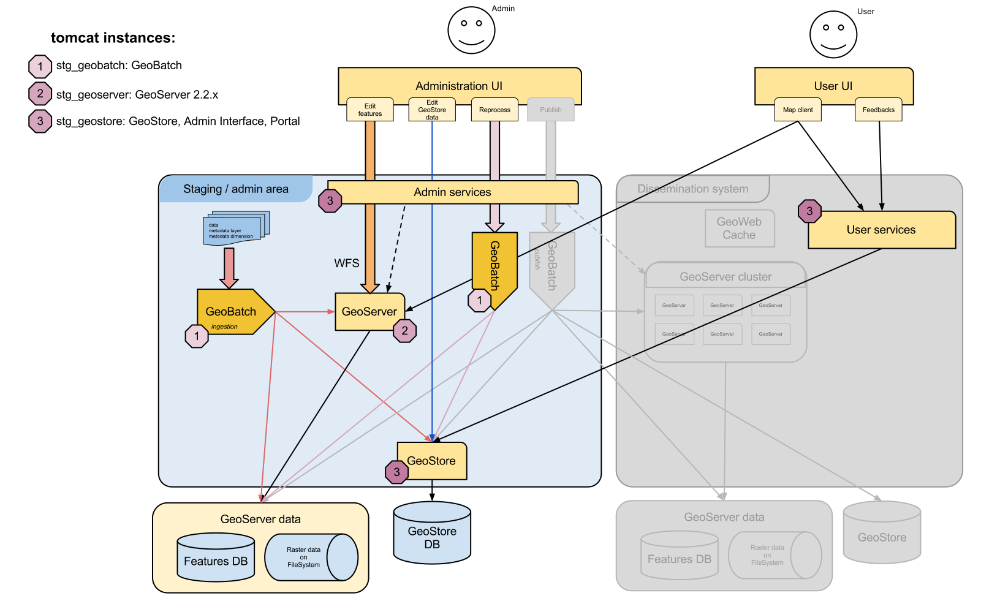

Training Machine Simplified Architecture
========================================

The UNREDD NMFS platform provides both a *staging* and a *dissemination* areas,
so the data can be reviewed and prior to its definite publication.

   LiveDVD simplified architecture
      
components not present in the Training machine have been grayed out in the figure.
Mainly, the dissemination block has been removed. This simplified version
contains all the building blocks needed to fully understand the platform, while
reducing the complexities needed only in real production environments.

In this case, both staging and dissemination areas share the same geoserver instance,
so the publishing flow, is copying the data from the *staging* workspace to tne
*dissemination* one in the same machine.

Tomcat instances
----------------

All of the UNREDD NFMS applications run on Apache Tomcat.
They are split into multiple Tomcat instances, so they can be run separately.
In the LiveDVD, you will find four Tomcat instances:

=============== ==== ==== ==========================
Instance name   HTTP AJP  Instance location
=============== ==== ==== ==========================
staging         8200 8100 /var/tomcat/staging
geoserver       8201 8101 /var/tomcat/geoserver
geobatch        8202 8102 /var/tomcat/geobatch
dissemination   8203 8103 /var/tomcat/dissemination
=============== ==== ==== ==========================

These are the web applications contained in each instance:

=============== ========================= =========================== ===============================================
Tomcat instance Contained applications    Configuration dir           Access URL
=============== ========================= =========================== ===============================================
staging         | stg_geostore            | /var/geostore/stg_config  | http://localhost/stg_geostore/rest
                | admin                   | [not needed]              | http://localhost/admin/
geoserver       | geoserver               | /var/geoserver            | http://localhost/geoserver/
geobatch        | geobatch                | /var/geobatch             | http://localhost/geobatch/
dissemination   | diss_geostore           | /var/geostore/diss_config | http://localhost/diss_geostore/rest
                | portal                  | /var/portal               | http://localhost/portal/
=============== ========================= =========================== ===============================================

.. note:

   Remember, user and password for all applications is: **admin/unredd**

Sample data
-----------

Sample data is accessible from a Desktop shorcut to :file:`/var/sample_data/[xxx]`, where ``[xxx]``
is a specific country name.

A sample data bundle will usually include:

* *vector*: Static vector shapefiles to be published in GeoServer.
* *raster*: Static raster files to be published in GeoServer.
* *mosaic*: Properties files needed by GeoServer to create a time-dependant raster mosaic.
* *styles*: SLD styles for all published data.
* *ingest*: Sample ingestable zip files.
* *stats*: Additional data used in statistics computation, such as area per pixel or rasterized provinces.
* *chartscripts*: Sample groovy scripts, html templates and translation strings to build charts from statistical data.
