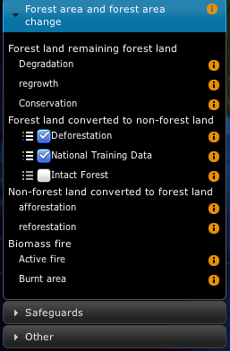

.. _unredd-portal-customize:

=========
Customize
=========

Customizing the portal
======================

To customize the portal for a new country, you need to create a new directory, with the structure depicted below.

::

   $PORTAL_CONFIG_DIR/
      ├── messages/
      │   ├── messages.properties
      │   ├── messages_en.properties
      │   └── messages_es.properties
      ├── layers.json
      ├── header.tpl
      ├── footer.tpl
      ├── portal.properties
      └── www/
          ├── unredd.css
          ├── custom.js
          ├── img/
          │   ├── banner_bg.jpg
          │   ├── flag.png
          │   ├── logos.jpg
          │   └── ui-elements.png
          └── loc/
              ├── en/
              │   └── [...]
              └── es/
                  └── [...]

An example directory is shipped with the portal application, under ``WEB-INF/default_config``. Use it as an example to build your own configuration directory.

The configuration directory contains the following files:

* **Messages** folder ``messages/``.
* **Layers** definitions ``layers.json``.
* **Header** and **footer** templates ``*.tpl``.
* Portal **properties** file.
* A collection of static resources,``web/``. Two of the files are mandatory:
  * ``unredd.css``, with portal styles.
  * ``custom.js``, with custom javascript functionality.

The remaining files under ``web`` directory (images ``img`` and localized files ``loc``) are referred from `templates` and `layers` configuration, and can be organized freely under ``www``.

The portal properties file
--------------------------

The file ``portal.properties`` contains some important parameters, such as the geostore location, or the WPS custom stats service.
Please review its contents so the parameters match the server setup.

These are the mandatory properties:

 * **languages** The languages to be displayed in the Portal interface. Make sure the corresponding localization file exists in the messages folder.
 * **geostore.url** The REST endpoint of the dissemination geostore.
 * **geostore.username** Dissemination GeoStore admin username.
 * **geostore.password** Dissemination GeoStore admin password.
 * **recaptcha.publickey** Needed to prevent robots send feedback and custom stats requests.
 * **recaptcha.privatekey** Ídem.

And these are optional properties for the realtime stats. If not set, a default value will be used:

 * **stats.url**: The WPS service base URL. Usually placed in the dissemination GeoServer. Defaults to *http://localhost:8080/geoserver/wps*
 * **stats.concurrency**: The number of simultaneous WPS requests to be launched in parallel. Should be in accordance with the GeoServer server's capabilities (a reasonable value is 2 * number of cores in the server). Defaluts to *4*.
 * **stats.processname**: The process name to be executed. Defaults to *gs:OnlineStatsWPS*.

An example ``portal.properties`` file::

  languages = {"en": "English", "fr": "Français", "es": "Español"}
  geostore.url = http://demo1.geo-solutions.it/diss_geostore/rest
  geostore.username = admin
  geostore.password = XXXXXX
  stats.url = http://demo1.geo-solutions.it/diss_geoserver/wps
  stats.concurrency = 8
  recaptcha.publickey = XXXXXXXXXXXXXXXXXXXXXXXXXXXXXXXXXXXXXXXX
  recaptcha.privatekey = XXXXXXXXXXXXXXXXXXXXXXXXXXXXXXXXXXXXXXXX

Translating the application
---------------------------

File names must be placed under ``$PORTAL_CONFIG_DIR/messages``, and named ``messages_<language_code>.properties``.
They contain localized string that are used to dynamically translate portal contents,
through Spring MVC framework, to get the localized text depending on the user’s selected language.

They contain ``key = value`` pairs, where key is the unique identifier of the localized text, and value is the actual translation (see example below)

::

    title = Système National de Surveillance des Forêts de la RDC
    subtitle = Ministère de l’Environnement, Conservation de la Nature et Tourisme
    layers = Couches
    redd_plus_activities = Activités REDD+
    redd_plus_activity = Activité REDD+
    deforestation = Déforestation (perte brute)
    degradation = Dégradation de la forêt
    enhancement = Accroissement des stocks de carbone
    conservation = Conservation
    sustainable_management = Gestion durable

The files that make use of the message files are:

* ``header.tpl`` and ``footer.tpl`` - the portal header and footer templates.
* ``layers.json`` - used to define the layers and its rendering.

To refer to the localized string from these files, add a replacement tag of the form ``${...}``, like in the example below:

::

    ${title}

Header and Footer templates
---------------------------

Header and footer templates are little `html` snippets containing the banner and the bottom links respectively.

Here is a typical ``header.tpl``:

.. code-block:: html

   

       

       

       ${title}
   

The banner element contains a flag, some logos, and the title text. Title changes depending on the language, so it is defined
using ``${<message_label>}``, which will be replace with the corresponding value in translation files (``messages*.properties``).

``footer.tpl`` is constructed the same way:

.. code-block:: html

   

       <a id="notice_download" href="static/${notice_url}" target="_blank">${information_note}</a>
       <a id="satisfaction_survey_link" href="${survey_url}" target="_blank">${satisfaction_survey}</a>
       <a id="user-group" href="http://groups.google.com/group/nfms4redd-users" target="_blank">${nfms_mailing_list}</a>
   

The main element, ``footer_links``, contains three links to a notice file, a survey, and the nfms4redd mailing list.
Again, the ``${...}`` elements will be replaced with specific content coming from translation messages.

Page design
-----------

The page design is defined in ``unredd.css``. This file defines the layout of the portal.
It should be used to customize colors, banner, and adjusting sized of objects.
For example to adjust the size and offset of the flag and logos images in the header.
For the ``logos`` element in the header template, we can set a background image, and its position an size using CSS syntax:

.. code-block:: css

  #logos
  {
    background: url(custom/img/logos.png) no-repeat 0 0;
    position: absolute;
    top: 19px;
    right: 20px;
    height: 55px;
    width: 130px;
    z-index: 1100;
  }

Images and other static resources
---------------------------------

Note that in the previous example, the image URL is ``static/img/logos.png``.
All the resources starting with ``static/`` correspond to the ``static/`` directory on portal config dir.
So, for the logo image, it has to be placed under ``$PORTAL_CONFIG_DIR/static/img/logos.png``.

Custom javascript
-----------------

Some custom portal actions have to be defined as javascript functions.
Place them in :file:``static/custom.js``. For example, to set the base
URLs for the WMS layers:

.. code-block:: js

   UNREDD.wmsServers = [
      "http://localhost",
      "http://127.0.0.1"
   ];

And to link click events to specific statistics:

.. code-block:: js

    drc_provinces: function(feature) {
       var that = {};
       that.title = function() {
           return UNREDD.langData.province + ": " + feature.attributes.PROVINCE;
       };
       that.statsLink = function() {
           return '/stg_geostore/rest/misc/category/name/ChartData/resource/name/deforestation_script_' +  feature.attributes.OBJECTID + '_' + languageCode + '/data?name=' + feature.attributes.PROVINCE;
       };
       
       return that;
    }

Layer definition
================

The file ``layers.json`` is in the root of the custom directory.

It contains the information to associate user interface elements (layer list pane on the left side of the page)
to the WMS layers provided by GeoServer, and customize legends, online legends thumbnails, and identify which
layers can be queried. It also allows to group layers into a three levels tree.

This is a sample ``layers.jon`` file:

.. code-block:: js

   {
     "layers": [
       {
         "id": "blueMarble",
         "baseUrl": "/geoserver_drc/gwc/service/wms",
         "wmsName": "unredd:world_topo_bathy",
         "imageFormat": "image/jpeg",
         "visible": true
       },{
         "id": "landsat",
         "baseUrl": "http://unredd.geo-solutions.it:9080/geoserver/wms",
         "wmsName": "unredd:training_background",
         "imageFormat": "image/png",
         "visible": true
       },{
         "id": "forestClassification",
         "label": "${forest_mask}",
         "baseUrl": "http://unredd.geo-solutions.it:9080/geoserver/wms",
         "wmsName": "unredd:training_mask",
         "imageFormat": "image/png8",
         "visible": true,
         "legend": "training_mask.png"
       },{
         "id": "administrativeUnits",
         "baseUrl": "http://unredd.geo-solutions.it:9080/geoserver/wms",
         "wmsName": "unredd:admin_local_level_governance_upng",
         "imageFormat": "image/png",
         "visible": true
       }
     ],
     
     "contexts": [
       {
         "id": "blueMarble",
         "active": true,
         "label": "${blue_marble}",
         "layers": ["blueMarble"]
       },{
         "id": "landsat",
         "active": true,
         "label": "${landsat}",
         "layers": ["landsat"]
       },{
         "id": "forestClassification",
         "active": true,
         "label": "${forest_mask}",
         "layers": ["forestClassification"]
       },{
         "id": "administrativeUnits",
         "active": true,
         "label": "${admin_units}",
         "layers": ["administrativeUnits"],
         "inlineLegendUrl": "/geoserver_drc/wms?REQUEST=GetLegendGraphic&VERSION=1.0.0&FORMAT=image/png&WIDTH=20&HEIGHT=20&LAYER=unredd:admin_units&TRANSPARENT=true"
       }
     ],
     
     "contextGroups": {
       "items": [
         {
           "group": {
             "label": "${base_layers}",
             "items": [
               { "context": "blueMarble" },
               { "context": "landsat" },
               { "context": "forestClassification" }
             ]
           }
         },
         {
           "group": {
             "label": "${admin_areas}",
             "items": [
               { "context": "administrativeUnits" }
             ]
           }
         }
         }
       ]
     }
   }

The ``layers.json`` file is divided into three sections:

* ``layers``
* ``contexts``
* ``contextGroups``

Let’s see each of the three sections above in detail.

Layers
------

Each object in the layers section of the JSON document has a correspondence with the layers defined in GeoServer.
The correspondence is many to one, meaning that more than one object in layers can be associated with the same GeoServer layer.

Here is a sample section of the `layers` object:

.. code-block:: js

   {
      "id": "reddPlusProjects",
      "label": "${redd_plus_projects}",
      "baseUrl": "/geoserver_drc/WMS",
      "WMSName": "unredd:redd_plus_projects",
      "imageFormat": "image/png",
      "visible": "true",
      "legend": "redd_plus_projects.png",
      "sourceLink": "http://www.observatoire-comifac.net/",
      "sourceLabel": "OFAC"
    }, {
      "id": "reddPlusProjects_simp",
      "baseUrl": "/geoserver_drc/WMS",
      "WMSName": "unredd:redd_plus_projects_simp",
      "imageFormat": "image/png",
      "visible": "false",
      "queryable": "true"
    }

Follows a description of each element in the `layers` object:

* ``id``: the layer identifier. Should be unique.
* ``label``: label to be shown on the user interface - its value points to an element in the translation ``messages`` file (see above) through substitution tag ``${...}``.
* ``baseUrl``: the base url of the associated GeoServer layer.
* ``WMSName``: the name of the associated GeoServer WMS layer.
* ``imageFormat`` the format of the image (usually ``image/jpeg``, ``image/png``, ``image/png8``, or ``image/gif``).
* ``visible`` (*optional*): ``"true"`` or ``"false"`` (defaults to ``"true"``) Whether the layer is visible or not (if not, it’s used only for queries. When a layer is queryable, a WMS ``getFeatureInfo`` request is sent to the server when clicking on it. In the sample above the `reddPlusProjects_simp` layer is a simplified version of reddPlusProject, used to highlight the contour of polygons.
* ``legend`` (*optional*): the file name of the layer legend. It is resolved to the custom dir path ``www/loc/<language_code>/images/<legend>`` by the application.
* ``sourceLink`` (*optional*): the link to the data source.
* ``sourceLabel`` (*optional*): the label to be used for the source link.
* ``queryable`` (*optional*): ``"true"`` or ``"false"`` (defaults to ``"false"``) whether the layer can be queried or not.
* ``wmsTime``: it can be either:

  * a list of time instances, using the following formats:

     * "YYYY", for yearly data. i.e. ``"2012"``
     * "YYYY-MM", for monthly data. i.e. ``"2012-08"``
     * "YYYY-MM-DD", for daily data. i.e. ``"2012-08-15"``

  * A reference to a GeoStore layer. In this case, the value is constructed with a replacement tag ``${time.**geostore_layer_name**}``. For example, ``${time.forest_mask_mosaic}`` will match the ``forest_mask_mosaic`` layer in GeoStore, so the time values will read from GeoStore's `layerUpdate` resources for the given layer.

The ``legend``, ``sourceLink`` and ``sourceLabel`` elements are used to show the layer legends in the Legend pane:

.. figure:: img/legend_pane.png
   :align: center

   Legend

Contexts
--------

``contexts`` puts in relation layer objects with real elements in the User Interface - see image below. A context can cointain one or more layers.

   Two levels layer pane

Here is an example of the context section in the JSON file:

.. code-block:: js

    {
      "id": "deforestation",
      "infoFile": "deforestation_def.html",
      "label": "${deforestation}",
      "layers": ["deforestation"]
    },{
      "id": "reddPlusInitiatives",
      "active": "true",
      "infoFile": "redd_plus_initiatives_def.html",
      "label": "${redd_plus_initiatives}",
      "layers": ["reddPlusInitiatives", "reddPlusInitiatives_simp"],
      "inlineLegendUrl": "/geoserver_drc/WMS?REQUEST=GetLegendGraphic&VERSION=1.0.0&FORMAT=image/png&WIDTH=20&HEIGHT=20&LAYER=unredd:redd_plus_projects&STYLE=redd_plus_initiatives&TRANSPARENT=true"
    }

Optional elements are identified with a * sign.

* ``id``: the context identifier. Should be unique.
* ``label``: label to be shown on the user interface - its value points to an element in the translation ``messages`` file (see above) through substitution tag ``${...}``.
* ``layers``: array with references to layer ``id``'s in the layers section.
* ``infoFile`` (*optional*): html file with the info related to the context. It is resolved to the custom dir path ``www/loc/<language_code>/html/<infoFile>``. It is loaded when clicking on the |infobutton|
* ``inlineLegendUrl`` (*optional*): url of the legend image to be shown at the left of the layer name, if available (see image below). It’s only usable if the layers has a legend that fits a 20x20 pixel image
* ``active`` (*optional*): indicates if layer will be active when page is first loaded.

.. |infobutton| image:: img/info_button.png

.. figure:: img/redd_registry_menu.png
   :align: center

   REDD registry menu

contextGroups
-------------

The ``contextGroups`` defines the tree structure (up to three levels) of the layers pane.

.. code-block:: js

    "contextGroups": {
      "items":[
         {
            "group":{
               "label":"${base_layers}",
               "items":[
                  { "context":"blueMarble" },
                  { "context":"facetForestClassification" },
                  { "context":"uclForestClassification" },
                  { "context":"landsat" },
                  { "context":"hillshade" }
               ]
            }
         },
         {
            "group":{
               "label":"${forest_area_and_forest_area_change}",
               "infoFile":"forest_area_and_forest_area_changes_def.html",
               "items":[
                  {
                     "group":{
                        "label":"${forest_land_remaining_forest_land}",
                        "items":[
                           { "context":"degradation" },
                           { "context":"regrowth" },
                           { "context":"conservation" }
                        ]
                     }
                  },
                  {
                     "group":{
                        "label":"${forest_land_converted_to_non_forest}",
                        "items":[
                           { "context":"deforestation" },
                           { "context":"trainingData" },
                           { "context":"intactForest" }
                        ]
                     }
                  }
               ]
            }
         }
      ]
   }

It’s a recursive structure, but the parser only renders up to the second level (''Deforestation'' and ''National Training Data'' in the image above)

* ``group``

  * At the first level it defines the different expandable elements in the “accordion” layers pane (REDD+ Registry in the image above)
  * At the second level (*optional*) it defines a grouping for the contexts
  * At the last (second or third levelS) it defines the context contained in the group. Each ``context`` string in the ``items`` array must match one of the contexts defined earlier

* ``label``: label to be shown on the user interface - its value points to an element in the translation messages through ``${...}`` replacement syntax.
