=======================
GeoBatch administration
=======================

Introduction
============

The following exercises will show how to configure the ingestion and processing of the data produced by the analysis system (TerraAmazon) on the web portal.

The GeoBatch ingestion and reprocess flows will preform care of the following tasks:

* Publication of spatial data on GeoServer

  * Data optimization
  * Creation of a GeoServer ImageMosaik store when the ingestion of the first time instance for a given layer occurs
  * Creation of a time dependent layer each time a layer comes from the analysis software

* Calculation of the statistical data
* Creation of the carts

Going through this lesson you will see how to perform the following administration tasks:

* :ref:`Define a new layer <layer>` - Layer resource on GeoStore
* :ref:`Ingest a new time instance for the layer <LayerUpdate>` - LayerUpdate resource on GeoStore (as we are not using the analysis software we will simulate its behavior by manually moving files in the ingest directory that triggers the ingestion
* :ref:`Configure the portal ``layers.json`` file to add the ingested map <add_layer_to_portal>`
* :ref:`Define new statistics <StatsDef>` - StatsDef resource on GeoStore
* :ref:`Launch the reprocess flow to calculate the statistics <reprocess-flow>` - StatsData resource on GeoStore
* :ref:`Define a new chart <ChartScript>` - ChartScript resource on GeoStore
* :ref:`Launch the reprocess flow to create the charts <reprocess-flow-2>` - ChartData

.. _layer:

Define a new layer
==================

In this exercise we will learn how to define a new layer resource on GeoStore.

Open the web browser and browse to the URL

http://localhost/stg_frontend

and type the user name and password for the GeoBatch administration interface:

* User: `admin`
* Password: `Unr3dd`

You will be shown a screen containing the layers already stored on GeoStore (none in our case)

Click on the *[raster]* link on the bottom of the page to add a new raster Layer. The following Layer resource editing mask will be shown.

* The `Staging mosaic path` is the path of the directory where the staging geoserver will store the data for the mosaic that will be created.
* The `Dissemination mosaic path` is the path of the directory where the staging geoserver will store the data for the mosaic that will be created.
The `Destination original data absolute path` contains the directory where the original data, if ingested from the analysis system (TerraAmazon) will be stored. It is not used in this training so we can put any value.

The system needs to know the size and extent of the map that will be ingested to make sure that it will be able to calculate the statistics on them, so it requests you to enter the following parameters:

* Pixel width - the width of the raster map in pixels
* Pixel eight - the height of the raster map in pixels
* Min x - the West bound of the map in EPSG:4326 srs
* Max x - the East bound of the map in EPSG:4326 srs
* Min y - the South bound of the map in EPSG:4326 srs
* Max y - the North bound of the map in EPSG:4326 srs

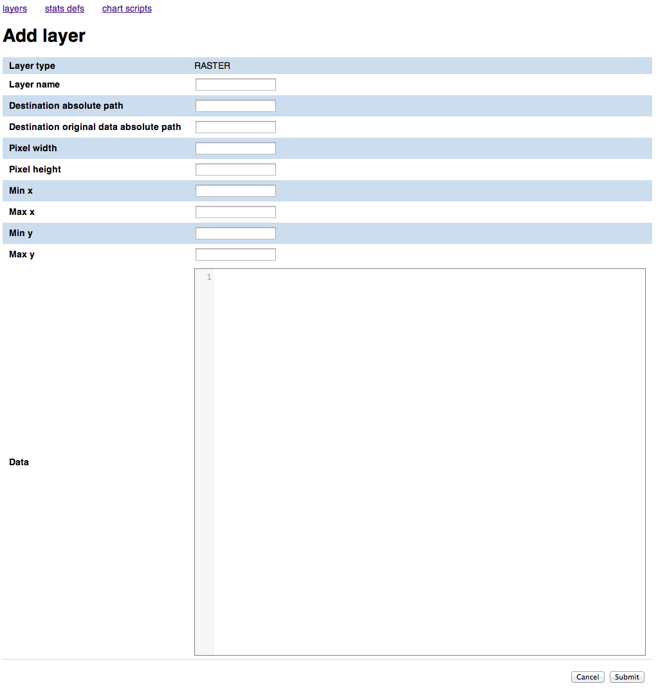

Fill it in with the following values:

=======================================  =============================================================
Field                                    Value
---------------------------------------  -------------------------------------------------------------
Staging mosaic path                      ``/var/stg_geoserver/extdata/forest_mask``
Dissemination mosaic path                ``/var/diss_geoserver/extdata/forest_mask``
Destination original data absolute path  ``/``
Pixel width                              ``3876``
Pixel height                             ``3563``
Min x                                    ``11.1010654``
Max x                                    ``32.2335506``
Min y                                    ``-14.0300339``
Max y                                    ``5.3959322``
=======================================  =============================================================

At the end of the process the mask should appear like this:

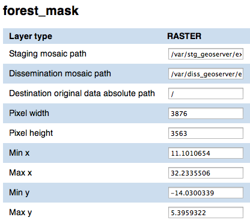

You can leave the data textbox empty.

When you have finished entering the data click ``Submit`` to add the Layer resource. You will be redirected to a page showing the data you just entered. Click on the *Layers* link to access the layers list page, that will now contain the layer you just entered:

.. figure:: _static/layers_forest_mask.png
   :align: center
   :scale: 80 %

If you click on the *layer updates* link you will notice that it's empty. That means that we have created the layer resource that will be linked to the time instances (LayerUpdates) coming from the analysis system, but none has been ingested yet.

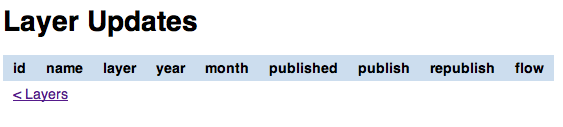

.. _LayerUpdate:

Ingest a new time instance for the layer
========================================

We are now going to learn how a new ``LayerUpdate`` is ingested on the portal by GeoBatch. We will manually simulate the behavior of the analysis software by copying the zip files containing the spatial data and XML definition into the GeoBatch ``ingest`` directory, thus triggering the GeoBatch ingestion flow.

But before we go on with the ingestion flow, let's have a look of the content of the zip files. If you unzip one of them, or browse to ``/Desktop/flowTestData/unzipped/forest_mask_1990``, you will notice that it contains a XML file (``info.xml``) and two directories (``data`` and ``original``).

* The directory ``data`` contains the data to be published in the dissemination system, and used to compute statistics.
* The content of the file ``info.xml`` is:

  .. code-block:: xml

    <?xml version="1.0" encoding="UTF-8"?>
    <info>
      <layername>forest_mask</layername>
      <format>raster</format>
      <year>2000</year>
    </info>

  where

  * ``<layername>`` is the name of the layer this update should be appended to
  * ``<year>`` is a mandatory element in a 4 digit format representing the year this update should be referenced to
  * ``<format>`` may be raster or vector
  * ``<month>`` (not used here) is a optional element in a 2 digit representing the month this update should be referenced to

* The ``original`` directory contains the original data used in the analysis step to produce the processed data. It may contain data in whatever format. This data will not be processed by the system, but will be made available for dissemination to authorized users

You can now copy the file ``/home/unredd/Training data/statistics/forest_mask_2000.zip`` into ``/var/stg_geobatch/input/ingestion/`` to start the ingestion flow:

``sudo -u tomcat6 cp /home/unredd/Training data/statistics/forest_mask_2000.zip /var/stg_geobatch/input/ingest/``

You can view the status of the ingestion flow on the GeoBatch admin interface:

* Browse to ``http://localhost/stg_geobatch/``
* Click on *Manage flows*
* Insert user name and password (admin/unredd) and click *Submit*
* Click on *IngestionFlow*
* Click on *Instances*

You should have one instance running or completed:

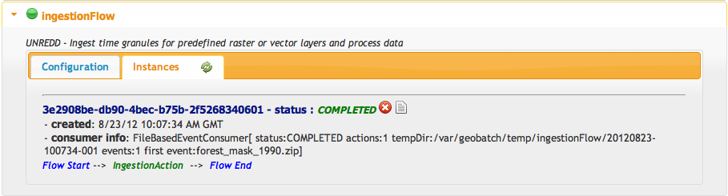

You can also view the log for the ingestion you just did by clicking on the *instance logs* icon.

.. figure:: _static/ingestion_flow_1_log.png
   :align: center
   :scale: 80 %

You can also check that the store and layer have been created on GeoServer by GeoBatch:

* Browse to ``http://localhost/stg_geoserver/``
* Insert user name and password (admin/Unr3dd) and click *Submit*
* Click on *Stores*
* Check that the forest_mask store is there

  .. figure:: _static/geoserver_check_ingestion_1.png
     :align: center
     :scale: 80 %

* Click on *Layers*
* Check that the forest_mask layer is there

  .. figure:: _static/geoserver_check_ingestion_2.png
     :align: center
     :scale: 80 %

You now have to set the style and the time dependency for the layer that GeoBatch just created.

Repeat the following operations both in ``http://localhost/diss_geoserver`` and in ``http://localhost/diss_geoserver``:

* Click on *Styles*
* Click on *Add a new styles*
* Type `forest_mask` in the ``name`` field
* Insert the following xml in the text area:

  .. code-block:: xml

    <?xml version="1.0" encoding="ISO-8859-1"?>
    <StyledLayerDescriptor version="1.0.0" xmlns="http://www.opengis.net/sld" xmlns:ogc="http://www.opengis.net/ogc"
      xmlns:xlink="http://www.w3.org/1999/xlink" xmlns:xsi="http://www.w3.org/2001/XMLSchema-instance" xmlns:gml="http://www.opengis.net/gml"
      xsi:schemaLocation="http://www.opengis.net/sld http://schemas.opengis.net/sld/1.0.0/StyledLayerDescriptor.xsd">
      <NamedLayer>
        <Name>forest_mask</Name>
        <UserStyle>
          <Name>Forest Mask</Name>
          <Title>Forest Mask</Title>
          <FeatureTypeStyle>
            <Rule>
              <RasterSymbolizer>
                <ColorMap type="values">
                  <ColorMapEntry color="#005700" quantity="1" opacity="1"/>
                </ColorMap>
              </RasterSymbolizer>
            </Rule>
          </FeatureTypeStyle>
        </UserStyle>
      </NamedLayer>
    </StyledLayerDescriptor>

Assign the new style to the `forest_mask` layer on ``http://localhost/stg_geoserver``:

* Click on *Layers*
* Click on *forest_mask*
* Click on the *Publishing* tab
* Under the *Default style* menu choose *forest_mask*

.. _add_layer_to_portal:

Configure the portal ``layers.json`` file to add the ingested map
=================================================================

Now that we have created an ImageMosaik store on Geoserver and have published one time instance for the forest mask map, we want to make it available on the portal.

To do this we will need to manually edit the layers.json file and:

* add a new ``layer`` object
* add a new ``context`` object
* modify one of the ``layerGroup`` objects and add the new context

Add a new layer object
----------------------

Open the file ``/home/unredd/Desktop/portal_config/layers.json`` on a text editor

Paste the following JSON structure under the ``forestCover`` layer:

  .. code-block:: json

    {
      "id": "forestMask",
      "baseUrl": "/diss_geoserver/wms",
      "wmsName": "unredd:forest_mask",
      "wmsTime": "${time.forest_mask}",
      "imageFormat": "image/png8",
      "visible": true,
      "legend": "forest_mask.png"
    }

So that the ``layers.json`` file looks like this:

  .. code-block:: json

    ...
    {
      "id": "countryBoundaries",
      "baseUrl": "http://demo1.geo-solutions.it/diss_geoserver/gwc/service/wms",
      "wmsName": "unredd:drc_boundary",
      "imageFormat": "image/png8",
      "visible": true,
      "sourceLink": "http://www.wri.org/publication/interactive-forest-atlas-democratic-republic-of-congo",
      "sourceLabel": "WRI"
    },
    {
      "id": "provinces",
      "baseUrl": "diss_geoserver/gwc/service/wms",
      "wmsName": "unredd:provinces",
      "imageFormat": "image/png",
      "visible": true
    },
    {
      "id": "forestMask",
      "baseUrl": "/diss_geoserver/wms",
      "wmsName": "unredd:forest_mask",
      "wmsTime": "${time.forest_mask}",
      "imageFormat": "image/png8",
      "visible": true,
      "legend": "forest_mask.png"
    }
    ...

Note that the ``forestMask`` layer object has a ``"wmsTime": "${time.forest_mask}"``, meaning that the time instances available will be fetched from GeoStore.

.. _StatsDef:

Add a new context object
----------------------

On the ``layers.json`` file, the following json structure under the ``forestCover`` context:

  .. code-block:: json

    {
      "id": "forestMask",
      "active": false,
      "label": "${forest_mask}",
      "layers": ["forestMask"],
      "inlineLegendUrl": "/diss_geoserver/wms?REQUEST=GetLegendGraphic&VERSION=1.0.0&FORMAT=image/png&WIDTH=20&HEIGHT=20&LAYER=unredd:forest_mask&TRANSPARENT=true"
    }

Modify the ``layerGroup`` objects and add the new context
----------------------------------------------------------------

Add the line

  .. code-block:: json

    { "context": "forestMask" }

to the following empty group in ``layers.json``

  .. code-block:: json

    ...
    "group": {
      "label": "Forest area and forest area change",
      "items": [
      ]
    }
    ...

so that it will become like this:

  .. code-block:: json

    ...
    "group": {
      "label": "Forest area and forest area change",
      "items": [
        { "context": "forestMask" }
      ]
    }
    ...

If you now open the portal you will see that there's a new time dependent layer in the *Superficie Forestal y Cambio en la Superficie Forestal* group.

Singe the new layers have been published only on `stg_geoserver`, if we try to enable the layer in the portal main page we'll see pink placeholders indicating that the map tile could not be find. This happens because when we defined the layer we connected it to the `stg_geoserver` instance.

As an exercise, try to connect the new layer to the `stg_geoserver` instance and then back to the `diss_geoserver` one and see how it affects the portal behaviour when enabling the new `forest_mask` layer.

Publish the new layer
=====================

As we saw at the end of the last chapter, the new layer has not yet been published on the dissemination system. To do that, go to the admin interface, click on the `[layer updates]` link and click on `[publish]`.

Now open the portal page and notice that the new map is available when enabling the `forest_mask` layer.

Assign the new style to the `forest_mask` layer on ``http://localhost/stg_geoserver``:

* Click on *Layers*
* Click on *forest_mask*
* Click on the *Publishing* tab
* Under the *Default style* menu choose *forest_mask*

Define new statistics
=====================

We are now going to add a new statistics definition XML that will be used by the GeoBatch reprocess flow to calculate the statistics in the form of CSV data. The data will be stored in a ``StatsData`` resource.

On the web browser, browse to the URL http://localhost/admin.

Click on the *stats def* link on the top of the page. You'll get a list of the preexisting StatsDef resources on GeoStore (none in our case).

Click on *Add stats def* to add a new stats def resource.

Fill the form with the following values:

*name*
  ``deforestation``
*layers*
  ``forest_mask``
*XML*

  .. code-block:: xml

    <?xml version="1.0" encoding="UTF-8" standalone="yes"?>
    <statisticConfiguration>
        <!-- internal name, used as key -->
        <name>area_admin1_deforestation</name>

        <!-- descriptive title to be presented to the user -->
        <title>Forest change in regions</title>

        <!-- detailed info about this stat, for presentation -->
        <description>Compute the forest and not forest area for the administrative areas</description>

        <!-- 0..n topics
             a topic is a simple string, and will be only used on client side
             to find out whether a stat is related to a given topic -->
        <topic>DRC</topic>
        <topic>area</topic>
        <topic>regions</topic>
        <topic>forest mask</topic>

        <!-- the requested stats (SUM, COUNT, MIN, MAX) -->
        <stats>
            <stat>SUM</stat>
        </stats>

        <deferredMode>true</deferredMode>

        <!-- The name of the layer holding the data that will be used in statistics -->
        <dataLayer>
            <file>/var/stg_geoserver/extdata/stats/area.tif</file>
        </dataLayer>

        <!-- 0..n classification layers -->
        <classificationLayer zonal="true">
            <file>/var/stg_geoserver/extdata/stats/provinces.tif</file>
            <nodata>255</nodata>
        </classificationLayer>

        <classificationLayer>
            <file>{FILEPATH}</file>
            <pivot>
                <value>0</value> <!-- not forest -->
                <value>1</value> <!-- forest -->
            </pivot>
            <nodata>255</nodata>
        </classificationLayer>

        <output>
            <format>CSV</format>
            <separator>;</separator>
            <missingValue>0</missingValue>
            <NaNValue>0</NaNValue>
        </output>

    </statisticConfiguration>

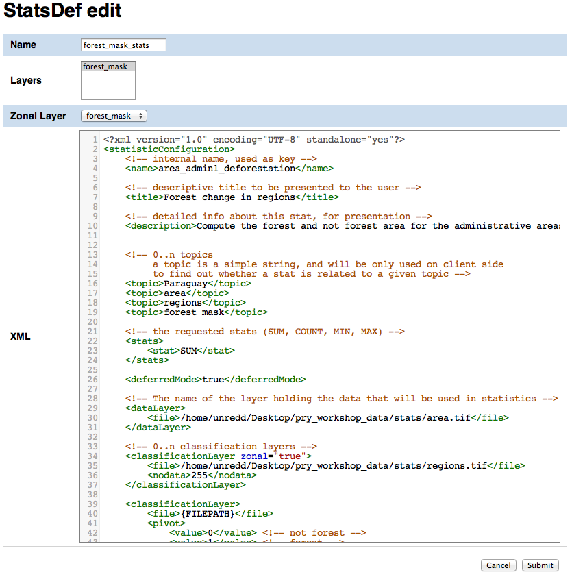

Click ``Submit`` to add the StatsDef resource.

If you go back to the stats def list and click *[stats data list]* you will notice that the list is empty. The ``StatsData`` resources, containing the forest and non-forest areas for each province, will be created by the GeoBatch reprocess flow that we are going to launch in the next exercise.

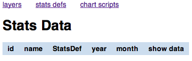

.. _reprocess-flow:

Launch the reprocess flow to calculate the statistics
=====================================================

Now that we have created a new ``StatsDef`` resource we can start the reprocess flow to make GeoBatch calculate the statistics data and store the result as a ``StatsData`` resource on GeoStore.

Click *stats def* on the top of the page to get a list of the available ``StatsDef`` resources.

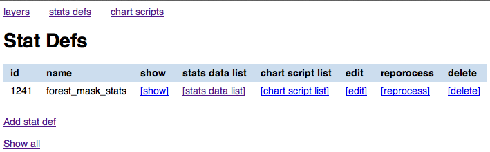

Click on the *[reprocess]* button for the ``forest_mask_stats`` resource. This will start the GeoBatch reprocess flow.

You can view the status of the reprocess flow on the GeoBatch admin interface:

* Browse to ``http://localhost/stg_geobatch/``
* Click on *Manage flows*
* Insert user name and password (admin/unredd) and click *Submit*
* Click on *ReprocessFlow*
* Click on *Instances*

You should have one instance running or completed:

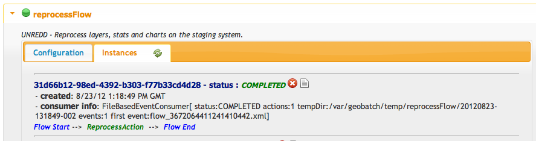

You can also view the log for the reprocess flow you just started by clicking on the *instance logs* icon.

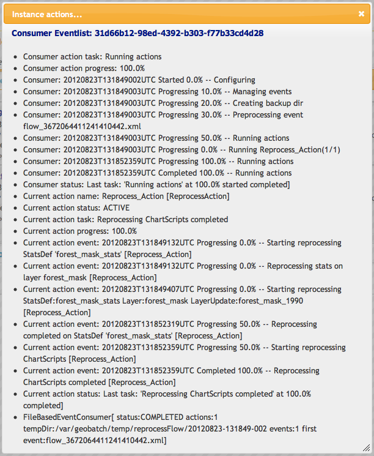

.. _ChartScript:

Define a new chart
==================

The data produced with the StatsDef XML definition is in CSV format, not ready yet to be presented on the web. We need to render the data we just created as charts to be shown on the web portal, and to do this we will create two files:

* a Groovy script that will fetch the ``StatsData`` CSV from GeoStore and parse it
* a html template that will be used by the Groovy script to create an html file for each line (or group of lines) in the CSV.

Create a new ChartScript record
-------------------------------

On the administration interface http://localhost/stg_frontend click on *chart scripts* and then on *Add Chart Script*.

Enter the following data:

===========  ===================================================================================
Field        Value
-----------  -----------------------------------------------------------------------------------
Name         ``deforestation_script``
StatsDef     ``forest_mask_stats``
Script path  ``/var/stg_geobatch/config/chartscripts/deforestation_stats.groovy``
===========  ===================================================================================

.. figure:: _static/chart_script_edit_mask.png
   :align: center

Click the ``Submit`` button to add the ChartScript resource.

If you go back to *chart scripts* and click *[chart data]* for the chart script resource we just created, you will noticed that there's no chart there. Charts will be created by GeoBatch when running again the reprocess flow.

Before we start the reprocess flow again, we should create the html template that will be used by the Groovy script to create the charts. The file is already stored in ``Desktop/pry_workshop_data/groovy_script/deforestation_chart_template.html`` so we are not going to manually create it, but we will modify it in order to create a new chart from the deforestation data.

.. _reprocess-flow-2:

Launch the reprocess flow to create the charts
==============================================

Once we have the Groovy script and the html template set up, we can run the reprocess flow again and let GeoBatch create the charts.

In order to do that, on the administation page click *chart scripts* and then the *run* button for the ``deforestation_script`` resource. This time the calculation takes some time as the script is running a raster processing procedure. You can view the status of the ingestion flow on the GeoBatch admin interface:

* Browse to ``http://localhost/stg_geobatch/``
* Click on *Manage flows*
* Insert user name and password (admin/unredd) and click *Submit*
* Click on *ReprocessFlow*
* Click on *Instances*

You should have one instance running or completed:

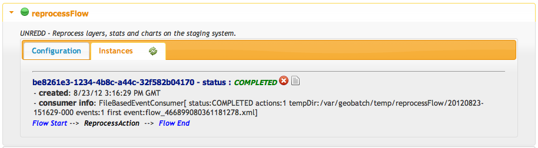

You can also view the log for the reprocess flow you just started by clicking on the *instance logs* icon.

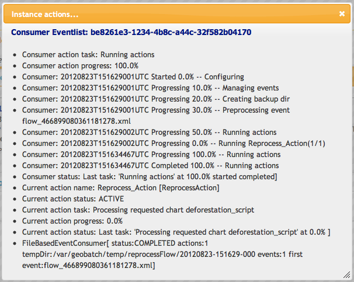

Once the reprocess flow has finished you can browse to the *chart script list* page to see the list of charts created:

* click on *chart script list*
* click on the *chart data* button for the ``deforestation_script`` resource
