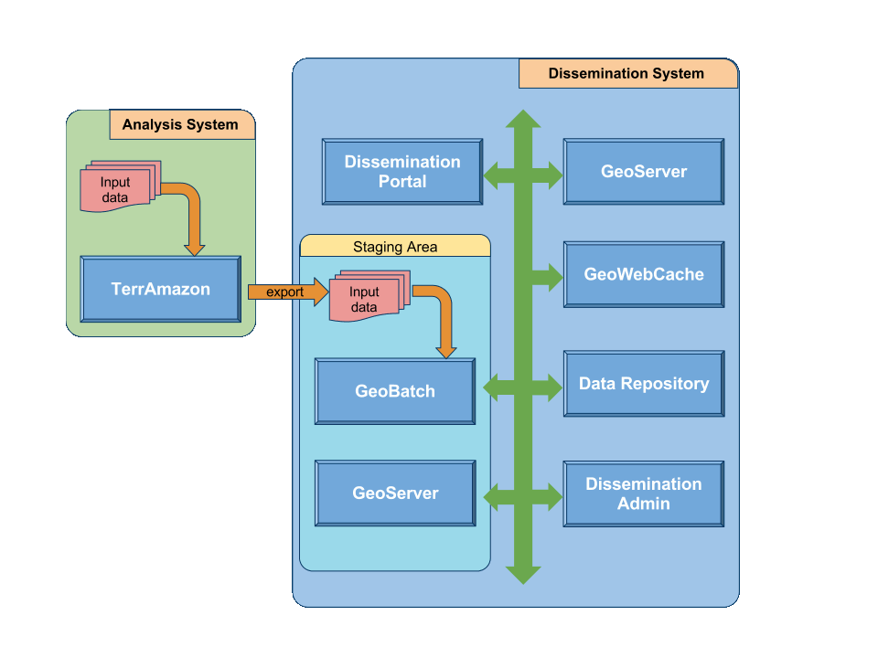

===================
Portal architecture
===================

System Overview
---------------

The whole system is composed of two main blocks: the *analysis system* and the *dissemination system*.

The **analysis system** includes:

* the source data mass import,
* the operator-assisted analysis part handled by the TerrAmazon application,
* the massive export of the preprocessed data in some agreed standard formats.

The **dissemination system** includes:

* ingestion of the data provided by the analysis system;
* specific geographic data processing (optimization);
* statistics processing (both fixed statistics, and on-demand statistics);
* data publishing (services offering interfaces for data query and retrieval);
* the user front-end where data can be searched for, accessed and visualized by a human;
* the admin front-end where staging data can be published, and where published data can be edited/corrected.

   System Overview

System Architecture
-------------------

.. image:: _static/introduction2.png
   :width: 800 px
   :align: center

Data Ingestion with *GeoBatch*
^^^^^^^^^^^^^^^^^^^^^^^^^^^^^^

GeoBatch is a geospatial aware batch processing system to ease the processing, the deploy, and the management of jobs on streams of geospatial data.

When the analysis subsystem exports its data, GeoBatch will start to process such data, by running site specific scripts that would end in the publication of the geographic data in GeoServer, but that would also perform all the preprocessing steps identified above, like as an instance upfront computation of statistics for predefined areas.

Geographic Data Publishing with *GeoServer*
^^^^^^^^^^^^^^^^^^^^^^^^^^^^^^^^^^^^^^^^^^^

GeoServer is an open source software server that allows the publishing of geospatial data from any major spatial data source using open standards from OGC and ISO.

Geographic Data Caching with *GeoWebCache*
^^^^^^^^^^^^^^^^^^^^^^^^^^^^^^^^^^^^^^^^^^

GeoWebCache is a web application used to cache map tiles coming from a variety of sources such as OGC Web Map Service (WMS).

It is used to improve the GeoServer workload for WMS service.

Non-geographic data publishing
^^^^^^^^^^^^^^^^^^^^^^^^^^^^^^

A flexible data repository is needed to store various pieces of information, be them static or fixed. These data may be created either by the server, or input by the user. Some examples are static statistics, as well as (possibly geo-referenced) comments and notes posted by users.

The Data Repository is accessed via a RESTful front end.

