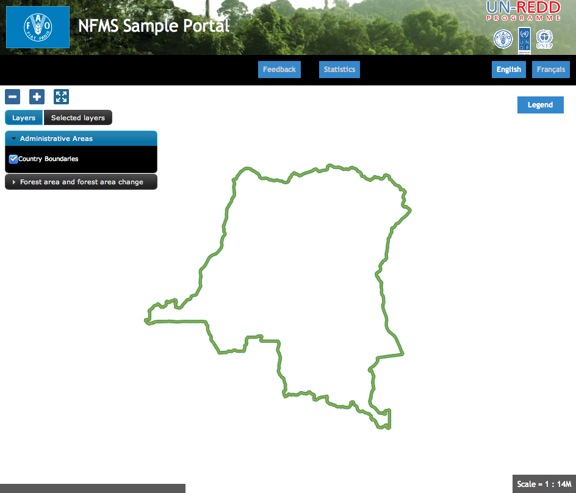

Portal: Initial Configuratiion
==============================

The NFMS portal is the platform puclic application of the platform, and it's utilized to publish the NFMS geographical and statistical data.

Noth the layout and the data shown of the portal van be customized depending on the needs of the countty. The application comes with a basic default configuration that can be used as a starting point.

In our case, we start for the following initial page:

The portal is accessible from:

  http://localhost/portal/

Configuration directory
-----------------------

The configuration directory  (:file:`/var/portal`) has the following structure::

	  /var/portal
	    |- portal.properties
	    |- layers.json
	    |- header.tpl
	    |- footer.tpl
	    |- messages/...
	    \- static/
	        |- unredd.css
	        |- custom.js
	        |- img/...
	        \- loc/
	            |- en/
	            │   |- documents/...
	            │   |- html/...
	            │   \- images...
	            \- es
	                |- documents/...
	                |- html/...
	                \- images/...

The main files are:

 * ``portal.properties``, contains the connection parameters and defines the supported languages.
 * ``layers.json``, the most important file, contains the configuration of the layers and the data to be shown on the portal.
 * ``headers.tpl`` and ``footer.tpl``, header and footer section of the main page.
 * ``messages/`` contains the text translated in different languages
 * ``static/`` contains all the other files: css stylesheets, custom javascript code, and other static files like documents and images

Configuration of the layout
---------------------------

Header and footer
.................

The header elements are contained in header.tml, in HTML format. You can add content
inside a *div* and *a* elements within the element ``
``, for example:

.. code-block:: html

  

  

The two logos come from the web pages of the related organizations. The id attribute will be utilized by the stylesheet ``unredd.css``
where an image and other visualization paramters are associated with it. As an exercise:

 * Open the file ``custom.css`` and find the elements "flag" and "logos".
 * Change the images ``flag.png`` and ``logos.png`` with the DRC ones (you can find them in ``Training data/img/`` directory

.. note:: `CSS tutorial <http://www.csstutorial.net/>`_

The template for the footer ``footer.tpl`` works the same way. In this case, we can add useful links to the portal under the element ``
``:

.. code-block:: html

  <a id="satisfaction_survey_link" href="${survey_url}" target="_blank">${satisfaction_survey}</a>
  <a id="user-group" href="http://groups.google.com/group/nfms4redd-users" target="_blank">${nfms_mailing_list}</a>

Here we can see some ${...} elements, like ``${survey_url}``, ``${satisfaction_survey}`` and ``${nfms_mailing_list}``.
These template elements will be substituted with translated text messages.

As an exercise:

  * Search the elements `survey_url`, `satisfaction_survey` and `nfms_mailing_list` in ``messages_fr.properties``.

To apply the changes, you will need to restart the application::

	$ sudo service diss_geoserver restart

Multilanguage support
---------------------
The file `messages.properties`` in the ``messages`` director contains the default translated messages. It's the text that will be used in case it has not be translated to a specific language. The files containing the text for a specific language have a suffix with the language code, following the standard <http://en.wikipedia.org/wiki/List_of_ISO_639-1_codes>`_.

To add a language (for example spanish):

 * Edit ``portal.properties`` and add the element ``"es": "Español"`` to the ``languages`` property::

    languages = {"es": "Español", "fr": "Françoise", "en": "English"}

 * Copy the file messages_fr.properties and give it the new name ``messages_es.properties``
 * Translate the text in ``messages_es.properties``.
 * Restart the application to apply the changes with the following command::

	sudo service diss_geoserver restart

Configuration of a new layer
----------------------------

The definition of the layers to be shown on the portal is in the file ``layers.json``.

``layers.json`` contains the information that associates the user interface elements (layer list panel on the left of the page) with the WMS layers
published on GeoServer, personalizes the legend, and defines which layers can be queryed. It also groups layers into categories.

The format utilized to store this information is JSON:

.. note:: JSON resources

  * `Introduction to the JSON format <http://www.json.org/>`_
  * `JSON validator <http://jsonformatter.curiousconcept.com/>`_

The file ``layers.json`` contains three sections:

* ``layers``
* ``contexts``
* ``contextGroups``

In these section we'll perform two exercises:

* First, we'll add the administrative units layer to the existing group "admin_areas".

* Then we'll add the UCL layer in a new layer group.

Layers
......

Before going through this exercise you will have to add a new vector layer to ``http://localhost/diss_geoserver`` using the data ``Training data/GIS/administrative_areas/provinces.*`` and assign it the style ``Training data/GIS/provinces.sld``.

Each "layer" object in the JSON file relates to a layer published on GeoServer, and describes the connection to the server to get the map.

.. code-block:: js

  "layers": [
     ...
     {
      "id": "provinces",
      "baseUrl": "http://localhost/diss_geoserver/gwc/service/wms",
      "wmsName": "unredd:provinces",
      "imageFormat": "image/png",
      "visible": true
    }
  ],

* It is possible to copy and paste one of the existing elements:

  * the new must be distinct from the other ones, for example "provinces"
  * the new wmsName will be "unredd:provinces"
  * the baseUrl must point to the GeoServer server from were we will get the layer

Contexts
........

Each context groups one or more layers and complements the information adding the data needed to show it in the graphical interface (active/not active, link to a file with information about the layer(s), URL for the inline legend, ...).

.. code-block:: js

  "contexts": [
    ...
    {
      "id": "provinces",
      "active": true,
      "label": "${provinces}",
      "infoFile": "provinces_def.html",
      "layers": ["provinces"],
      "inlineLegendUrl": "http://localhost/diss_geoserver/wms?REQUEST=GetLegendGraphic&VERSION=1.0.0&FORMAT=image/png&WIDTH=20&HEIGHT=20&LAYER=provinces&TRANSPARENT=true&RULE=border"
    }
  ],

* Add a new "context" object, with the same structure and values as "country", but with the following differences:

  * the new "id" will be "provinces"
  * the new label will be ${provinces}. Again, the syntax ${...} will be substituted in a localised text.
  * in "infoFile" we will put "provinces_def.html". This will create a link to a document with the layer information (:file:`static/loc/<lang>/html`).
  * in "layers" we will put ["provinces"], which references the layer we just created
  * In "inlineLegendUrl" we will put the parameter `LAYER=unredd:provinces` to generate an image with the legend

ContextGroups
.............

"contextGroups" is a recursive structure used to group context in the layer panel on the portal web page. A "group" element can contain another group or an array of contexts defined in the "contexts" object.

.. code-block:: js

  "contextGroups":
  {
    "items": [
      {
        "group": {
          "label": "${admin_areas}",
          "items": [
            { "context": "country" }
          ]
        }
      }
    ]
  }

* Add a new element `{ "context": "provinces" }` after the `{ "context": "country" }` element. This will include the new layer context to the provinces context group

* Finally, utilize the JSON validator to check the syntax of the new :file:`layers.json`, and reload the page

At the end of the process, the content of the file should be the following:

.. code-block:: js

  {
    "layers": [
      {
        "id": "countryBoundaries",
        "baseUrl": "http://demo1.geo-solutions.it/diss_geoserver/gwc/service/wms",
        "wmsName": "unredd:drc_boundary",
        "imageFormat": "image/png8",
        "visible": true,
        "sourceLink": "http://www.wri.org/publication/interactive-forest-atlas-democratic-republic-of-congo",
        "sourceLabel": "WRI"
      },
      {
        "id": "provinces",
        "baseUrl": "diss_geoserver/gwc/service/wms",
        "wmsName": "unredd:provinces",
        "imageFormat": "image/png",
        "visible": true
      }
    ],

    "contexts": [
      {
        "id": "countryBoundaries",
        "active": true,
        "label": "${country_boundaries}",
        "layers": ["countryBoundaries"]
      },
      {
        "id": "provinces",
        "active": false,
        "label": "${provinces}",
        "infoFile": "provinces_def.html",
        "layers": ["provinces"],
        "inlineLegendUrl": "http://localhost/diss_geoserver/wms?REQUEST=GetLegendGraphic&VERSION=1.0.0&FORMAT=image/png&WIDTH=20&HEIGHT=20&LAYER=provinces&TRANSPARENT=true&RULE=border"
      }
    ],
    "contextGroups":
    {
      "items": [
        {
          "group": {
            "label": "${admin_areas}",
            "items": [
              { "context": "countryBoundaries" },
              { "context": "provinces" }
            ]
          }
        },
        {
          "group": {
            "label": "Forest area and forest area change",
            "items": [
            ]
          }
        }
      ]
    }
  }

Initial extent of the map and server prefix
-------------------------------------------

The file ``static/custom.js`` contains the initial map extent and zoom level, and an array of default WMS servers.

.. code-block:: js

  UNREDD.restrictedExtent = new OpenLayers.Bounds(-20037508, -20037508, 20037508, 20037508);
  UNREDD.maxResolution = 4891.969809375;
  UNREDD.mapCenter = new OpenLayers.LonLat(2500000, -400000);
  UNREDD.defaultZoomLevel = 0;

  UNREDD.wmsServers = [
      //"http://demo1.geo-solutions.it",
      //"http://incuweb84-33-51-16.serverclienti.com"
  ];

*UNREDD.mapCenter* contains the coordinate of the center in Google Mercator proection (EPSG:900913 or EPSG:3857), the coordinate reference system of the web application.

To increase/decrease the initial zoom level you can increase/decrease the value of *UNREDD.defaultZoomLevel*.

Finally we can observe that some of the *baseUrl* values in the previous chapter don't contain a server. These URLs are completed by the software by adding one of the server specified in *UNREDD.wmsServers*.

Exercise: Configure a new layer group
-------------------------------------

Let's repeat the previous exercise to add a forest classification layer.

* Before going through this exercise you will have to add a new vector layer to ``http://localhost/diss_geoserver`` using the data ``Training data/GIS/forest_classification.tif`` and assign it the style ``Training data/GIS/provinces.sld``.

* For the new layer we will use the id "forest_classification" and the wms layer name "unredd:forest_classification". Then we will add a new `"legend": "forest_classification.png"` to show the layer legend. This attribute reference a localized image in :file:`static/loc/<lang>/images/`.

* The new "context" will contain only three elements: `"id": "forest_classification"`, `"label": "${ucl_forest_classification}`, and `"layers": ["forest_classification"]`.

* We will add the new context in the context group with `"label": "Forest area and forest area change"`.

* After validating the JSON and reloading the page, we will have the new layer in the portal page.

At the end of the exercise the content of `layers.json` will be:

.. note:: Order matters: the layers defined first are shown on the top of the following ones.

.. code-block:: js

  {
    "layers": [
       {
        "id": "forest_classification",
        "baseUrl": "/diss_geoserver/gwc/service/wms",
        "wmsName": "unredd:forest_classification",
        "imageFormat": "image/png",
        "visible": true,
        "legend": "forest_classification.png"
      },
      {
        "id": "countryBoundaries",
        "baseUrl": "http://demo1.geo-solutions.it/diss_geoserver/gwc/service/wms",
        "wmsName": "unredd:drc_boundary",
        "imageFormat": "image/png8",
        "visible": true,
        "sourceLink": "http://www.wri.org/publication/interactive-forest-atlas-democratic-republic-of-congo",
        "sourceLabel": "WRI"
      },
      {
        "id": "provinces",
        "baseUrl": "/diss_geoserver/gwc/service/wms",
        "wmsName": "unredd:provinces",
        "imageFormat": "image/png",
        "visible": true
      }
    ],

    "contexts": [
      {
        "id": "countryBoundaries",
        "active": true,
        "label": "${country_boundaries}",
        "layers": ["countryBoundaries"]
      },
      {
        "id": "provinces",
        "active": false,
        "label": "${provinces}",
        "infoFile": "provinces_def.html",
        "layers": ["provinces"],
        "inlineLegendUrl": "http://localhost/diss_geoserver/wms?REQUEST=GetLegendGraphic&VERSION=1.0.0&FORMAT=image/png&WIDTH=20&HEIGHT=20&LAYER=provinces&TRANSPARENT=true&RULE=border"
      },
      {
        "id": "forest_classification",
        "label": "${ucl_forest_classification}",
        "layers": ["forest_classification"]
      }
    ],

    "contextGroups":
    {
      "items": [
        {
          "group": {
            "label": "${admin_areas}",
            "items": [
              { "context": "countryBoundaries" },
              { "context": "provinces" }
            ]
          }
        },
        {
          "group": {
            "label": "Forest area and forest area change",
            "items": [
              { "context": "forest_classification" }
            ]
          }
        }
      ]
    }
  }
