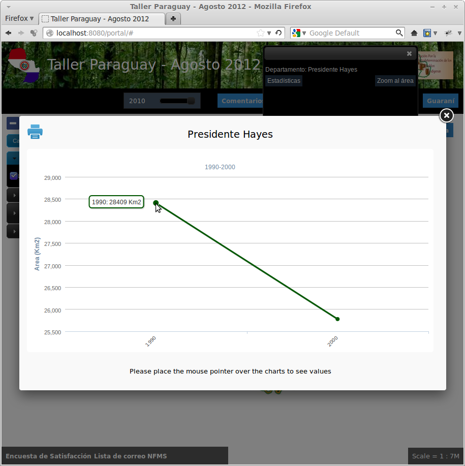

Portal: Adding Ingested Layer and Statistics Charts
===================================================

Finally, we are going to add to the Portal the newly ingested "forest_mask"
layer, make the "regions" layer queryable, and link the statistics charts to it.

Adding the Forest Mask layer
----------------------------

Again, we are adding a "layer" and a "context" to the ``layers.json``. We
already learned how to do it, so just paste the following elements to the file.

* Add the following layer definition:

.. code-block:: js

   {
      "id": "forestMask",
      "baseUrl": "/diss_geoserver/wms",
      "wmsName": "unredd:forest_mask",
      "wmsTime": "${time.forest_mask}",
      "imageFormat": "image/png8",
      "visible": true,
      "legend": "forest_mask.png"
   }

Note that the "wmsTime" element, instead of listing a collection of timestamps,
is using a special syntax: "${time.forest_mask}". In this way we indicate to
the Portal application that the timestamps should be retrieved from GeoBatch's
LayerUpdates. So when a new LayerUpdate is ingested, the time stamps are
automatically updated.

* Add the following context definition:

.. code-block:: js

   {
      "id": "forestMask",
      "active": false,
      "label": "${forest_mask}",
      "layers": ["forestMask"]
   }

This is a normal context definitions, similar as the others we have seen during
the workshop.

Finally, add the context to the same layer group where Forest Cover is. It
should look like:

.. code-block:: js

   {
     "group": {
       "label": "${forest_area_and_forest_area_change}",
       "items": [
         { "context": "forestCover" },
         { "context": "forestMask" }
       ]
     }
   }

Making Regions queryable
------------------------

To make regions queryable, we will use an auxiliary regions layer called
"regions_simp". It is the same as the "regions" layer, but the geometries have
been simplified, so they can be loaded in the the Portal even in poorly
performant web browsers.

The trick is to add "regions_simp" as an "invisible" layer and use it only as
the query target.

Add this new layer element to ``layers.json``:

.. code-block:: js

    {
      "id": "regionsSimp",
      "baseUrl": "/diss_geoserver/wms",
      "wmsName": "unredd:regions_simp",
      "imageFormat": "image/png",
      "visible": false,
      "queryable": true
    }

Note that the "visible" attribute is set to `false`, so it won't be shown into
the map, but the new "queryable" attribute is set to `true`, so this is the layer
that will be used when clicking over the layer to get its related information.

Search for the "regions" context, and edit the "layers" attribute so it includes
both "regions" and "regionsSimp" layers:

.. code-block:: js

   "layers": ["regions", "regionsSimp"]

In this way, when the regions layer is visible, a click on the map will trigger
a query over the "regionsSimp" layer.

Linking to the Statistics charts
--------------------------------

Before testing the new changes in the portal, we need to add a custom javascript
function in "custom.js" which contains the actions to be taken when a query
response arrives from the server.

* Open the :file:`static/custom.js` file, and add the following code into the ``UNREDD.layerInfo`` object:

  .. code-block:: js

      regions_simp: function (feature) {
        var that = {};
        that.title = function() {
            return messages.province + ": " + feature.attributes.NAME1;
        };
        that.statsLink = function() {
            return UNREDD.wmsServers[0] + '/stg_geostore/rest/misc/category/name/ChartData/resource/name/deforestation_script_' +  feature.attributes.ID + '_' + languageCode + '/data?name=' + feature.attributes.NAME1;
        };
        return that;
      }

* Reload the Portal page, click over a Department, and click on the "statistics" link. You should see:

Publishing a layer update chart
-------------------------------

To publish the chart and make it available on the portal:

* Open the administration interface (http://localhost/admin) and login (admin/Unr3dd)
* Click on the `[layer updates]` link related to the `forest_mask` layer
* Click on the `[republish]` link related to the year you want to publish

As an exercise:

* Ingest, calculate statistics and render deforestation charts for the years 2005, 2010.
